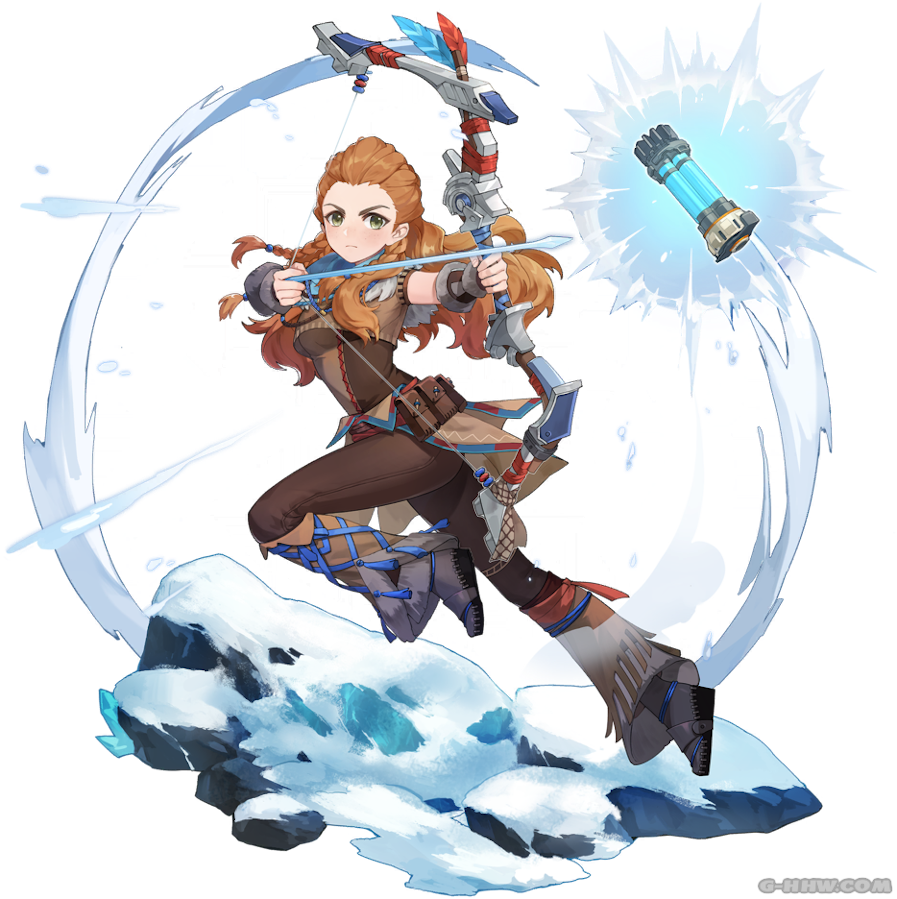

# Aloy

##  Aloy

## **Base Stats**

| Lv | Base HP | Base ATK | Base DEF | Cryo DMG Bonus |
| :--- | :--- | :--- | :--- | :--- |
| 60 | 7070 | 152 | 439 | 14.4% |
| 60+ | 7587 | 163 | 471 | 14.4% |
| 70 | 8339 | 179 | 517 | 14.4% |
| 70+ | 8856 | 190 | 550 | 21.6% |
| 80 | 9616 | 206 | 597 | 21.6% |
| 80+ | 10133 | 217 | 629 | 28.8% |
| 90 | 10899 | 234 | 676 | 28.8% |

## **Attacks**



**Normal Attacks**  
Perform up to 4 consecutive shots with a bow.

| String | Talent 9% | Frames | MV/s |
| :--- | :--- | :--- | :--- |
| 1-Hit DMG | 35.52% + 39.96% | 18 + 30 | 150.96%/s |
| 2-Hit DMG | 72.52% | 48 | 185%/s |
| 3-Hit DMG | 88.8% | 85 | 167.15%/s |
| 4-Hit DMG | 110.41% | 128 | 162.75%/s |
| Recovery | -- | -- | -- |

**Charged Attacks**  
Perform a more precise Aimed Shot with increased DMG. While aiming, biting frost will accumulate on the arrowhead. A fully charged frost arrow will deal Cryo DMG.

| String | Talent 9% | Frames | MV/s |
| :--- | :--- | :--- | :--- |
| Aimed Shot | 80.58% | -- | -- |
| Fully-Charged Aimed Shot | 210.8% | -- | -- |

* A Fully-Charged Aimed Shot applies 1A Cryo.

**Plunge Attacks**  
Fires off a shower of arrows in mid-air before falling and striking the ground, dealing AoE DMG upon impact.

| String | Talent 9% |
| :--- | :--- |
| Plunge DMG | 104.41% |
| Low Plunge DMG | 208.77% |
| High Plunge DMG | 260.76% |



Aloy throws a **Freeze Bomb** in the targeted direction that explodes on impact, dealing Cryo DMG. After it explodes, the **Freeze Bomb** will split up into many **Chillwater Bomblets** that explode on contact with opponents or after a short delay, dealing Cryo DMG.  
When a **Freeze Bomb** or **Chillwater Bomblet** hits an opponent, the opponent's ATK is decreased and Aloy receives 1 **Coil stack**.  
Aloy can gain up to 1 **Coil stack** every 0.1s. 

**Coil**  
• Each stack increases Aloy's Normal Attack DMG.  
• When Aloy has 4 **Coil stacks**, all stacks of **Coil** are cleared. She then enters the **Rushing Ice** state, which further increases the DMG dealt by her Normal Attacks and converts her Normal Attack DMG to Cryo DMG. 

While in the **Rushing Ice** state, Aloy cannot obtain new **Coil** stacks.  
**Coil** effects will be cleared 30s after Aloy leaves the field.

| Attribute | Freeze Bomb | Chillwater Bomblets |
| :--- | :--- | :--- |
| Skill DMG \(T9%\) | 301.92% | 68% |
| Particles | 5 \(-\) | - | 
| Frames | 67 | - |
| GU | 1A | 1A |
| ICD | - | 3 hits / 2.5s |
| Snapshot | Snapshot | Snapshot |
| Damage Element | Cryo | Cryo |
| Damage Type | Skill | Skill |
| CD | 20s | - | 

| Attribute                           | Talent 9 Data        |
| ----------------------------------- | -------------------- |
| ATK Decrease                        | 14%                  |
| ATK Decrease Duration               | 6s                   |
| Coil Normal Attack DMG Bonus        | 9.07% / 18.13% / 27.2% |
| Rushing Ice Normal Attack DMG Bonus | 45.33%                |
| Rushing Ice Duration                | 10s                  |
| CD                                  | 20s                  |

**Notes**
* Aloy's attacks while in the **Rushing Ice** state follow standard ICD (3 hits/2.5s)
* **Chillwater Bomblets** share ICD and follow standard ICD.
* Aloy can gain **Coil Stacks** while off-field.
* **Chillwater Bomblets** snapshot on **Frozen Wilds** cast.
* Recasting **Frozen Wilds** will cause existing **Chillwater Bomblets** to explode.




Aloy throws a Power Cell filled with Cryo in the targeted direction, then detonates it with an arrow, dealing AoE Cryo DMG.

| Attribute | Burst |
| :--- | :--- |
| Skill DMG \(T9%\) | 610.64% |
| Frames | 118 |
| GU | 2B |
| ICD | - |
| Snapshot | Snapshot |
| Damage Element | Cryo |
| Damage Type | Burst |
| Energy Cost | 40 |
| CD | 12 s |




## **Ascension Passives**



### **Easy Does It**

When Aloy is in the party, animals who produce Fowl, Raw Meat, or Chilled Meat will not be startled when party members approach them.

* Animals still get startled if you get too close to them.
* Animals still get startled if you kill one of them in a group.




### **Combat Override**

When Aloy receives the **Coil** effect from **Frozen Wilds**, her ATK is increased by 16%, while nearby party members' ATK is increased by 8%. This effect lasts 10s.



### **Strong Strike**

When Aloy is in the **Rushing Ice** state conferred by **Frozen Wilds**, her Cryo DMG Bonus increases by 3.5% every 1s. A maximum Cryo DMG Bonus increase of 35% can be gained in this way.



## **Constellations**



### **Star of Another World**

The time has not yet come for this person's corner of the night sky to light up.



## **Full Talent Values**


### Normal Attacks

|  | Lv6 | Lv7 | Lv8 | Lv9 | Lv10 | Lv11 |
| :--- | :--- | :--- | :--- | :--- | :--- | :--- |
| 1-Hit DMG | 29.04% + 32.67% | 31.2% + 35.1% | 33.36% + 37.53% | 35.52% + 39.96% | 37.68% + 42.39% | 39.84% + 44.82% |
| 2-Hit DMG | 59.29% | 63.7% | 68.11% | 72.52% | 76.93% | 81.34% |
| 3-Hit DMG | 72.6% | 78% | 83.4% | 88.8% | 94.2% | 99.6% |
| 4-Hit DMG | 90.27% | 96.98% | 103.69% | 110.41% | 117.12% | 123.84% |

### Charged Attack

|  | Lv6 | Lv7 | Lv8 | Lv9 | Lv10 | Lv11 |
| :--- | :--- | :--- | :--- | :--- | :--- | :--- |
| Aimed Shot | 63.75% | 69.36% | 74.97% | 80.58% | 86.7% | 92.82% |
| Fully-Charged Aimed Shot | 173.6% | 186% | 198.4% | 210.8% | 223.2% | 235.6% |

### Plunge 

|  | Lv6 | Lv7 | Lv8 | Lv9 | Lv10 | Lv11 |
| :--- | :--- | :--- | :--- | :--- | :--- | :--- |
| Plunge DMG | 82.6% | 89.87% | 97.14% | 104.41% | 112.34% | 120.27% |
| Low Plunge DMG | 165.17% | 179.7% | 194.23% | 208.77% | 224.62% | 240.48% |
| High Plunge DMG | 206.3% | 224.45% | 242.61% | 260.76% | 280.57% | 300.37% |



|  | Lv6 | Lv7 | Lv8 | Lv9 | Lv10 | Lv11 | Lv12 | Lv13 |
| :--- | :--- | :--- | :--- | :--- | :--- | :--- | :--- | :--- |
| Freeze Bomb DMG | 248.64% | 266.4% | 284.16% | 301.92% | 319.68% | 337.44% | 355.2% | 377.4% |
| Chillwater Bomblets | 56% | 60% | 64% | 68% | 72% | 76% | 80% | 85% |
| ATK Decrease | 13% | 14% | 14% | 14% | 15% | 15% | 15% | 15% |
| Coil Normal Attack DMG Bonus | 7.7% / 15.4% / 23.1% | 8.16% / 16.31% / 24.47% | 8.61% / 17.22% / 25.83% | 9.07% / 18.13% / 27.2% | 9.52% / 19.04% / 28.56% | 9.98% / 19.95% / 29.93% | 10.43% / 20.86% / 31.29% | 10.89% / 21.77% / 32.66% |
| Rushing Ice Normal Attack DMG Bonus | 38.5 | 40.78 | 43.05 | 45.33 | 47.6 | 49.88 | 52.15 | 54.43 |

**ATK Decrease Duration:** 6s  
**Rushing Ice Duration:** 10s  
**Cooldown:** 20s




|  | Lv6 | Lv7 | Lv8 | Lv9 | Lv10 | Lv11 | Lv12 | Lv13 |
| :--- | :--- | :--- | :--- | :--- | :--- | :--- | :--- | :--- |
| Skill DMG | 502.88% | 538.8% | 574.72% | 610.64% | 646.56% | 682.48% | 718.4% | 763.3% |

**Cooldown:** 12s  
**Energy Cost:** 40




## Evidence Vault


