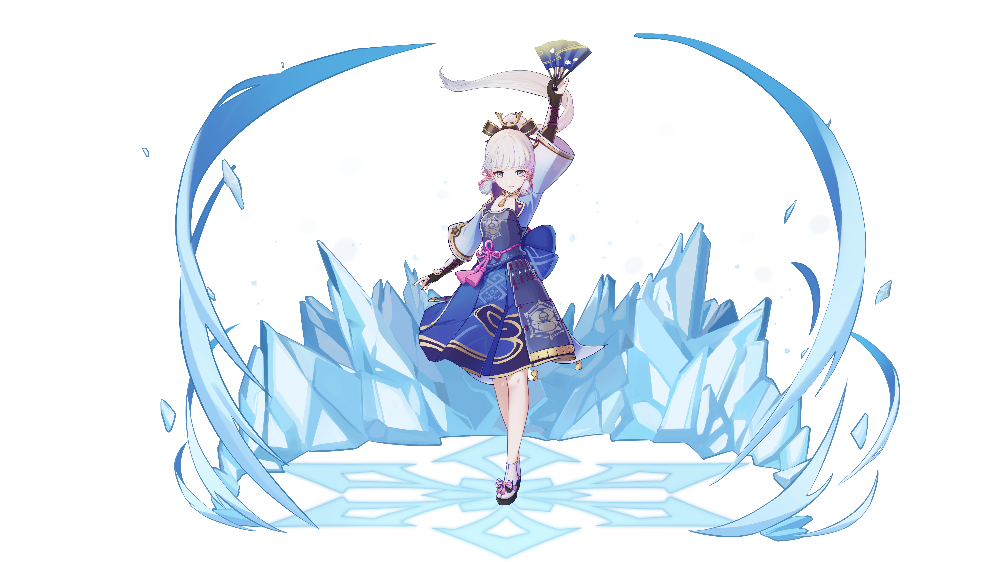

# Kamisato Ayaka

## **Resources**

* [Ayaka Written Guide](https://keqingmains.com/ayaka/)
* [7 Minute Quick Guide to Ayaka](https://youtu.be/G_gQ0P9s6BU)

##  Kamisato Ayaka

## **Base Stats**

| Lv | Base HP | Base ATK | Base DEF | CRIT DMG |
| :--- | :--- | :--- | :--- | :--- |
| 60 | 8341 | 222 | 509 | 69.2% |
| 60+ | 8951 | 238 | 546 | 69.2% |
| 70 | 9838 | 262 | 600 | 69.2% |
| 70+ | 10448 | 278 | 637 | 78.8% |
| 80 | 11345 | 302 | 692 | 78.8% |
| 80+ | 11954 | 318 | 729 | 88.4% |
| 90 | 12858 | 342 | 784 | 88.4% |

## **Attacks**



**Normal Attacks**  
Performs up to 5 rapid strikes.

| String | Talent 6% | Frames | MV/s |
| :--- | :--- | :--- | :--- |
| 1-Hit DMG | 66.46% | 8 | 498.45%/s |
| 2-Hit DMG | 70.76% | 28 | 294.04%/s |
| 3-Hit DMG | 91.02% | 56 | 244.54%/s |
| 4-Hit DMG | 32.92% ×3 (98.76%) | 98 | 198.18%/s |
| 5-Hit DMG | 113.64% | 136 | 194.40%/s |

**Charged Attacks**  
Consumes a certain amount of Stamina(20) to unleash a flurry of sword ki.
* Ayaka's charged attacks are the first to work in a special way, as follows: When Ayaka starts her CA:  
  * First: A hitscan occurs for enemies in a radius around her after the NA is over.  
  * Second: After selecting an enemy (closest target or random?), Ayaka will spawn a gadget that locks onto that enemy and follows them regardless of her normal range.  
  * Third: After a brief period, this gadget will stop following the enemy and do an additional 3 hitscans, one for each hit.  
  * Fourth: A cut with a hitbox will be spawned for each enemy in range of the hitscans. This cut has a hitbox that can hit multiple enemies, but there is an ICD between each cut doing damage to the same enemy. If an enemy leaves the gadget's range while it is still performing the hitscans, the enemy will not be affected by the remaining hitscans. Conversely, the remaining hitscans will affect any enemy that enters the gadget's range even after it has started.  

| String | Talent 6% | Frames | MV/s |
| :--- | :--- | :--- | :--- |
| Charged Attack DMG | 80.13%×3 (240.39%) | -- | -- |
| N1C | 66.46% + 80.13%×3 (306.85%) | 96 | 191.78%/s |
| N2C | 137.22% + 80.13%×3 (377.61%) | 115 | 197.01%/s |
| N3C | 228.24% + 80.13%×3 (468.63%) | 140 | 200.84%/s |
| N4C | 327% + 80.13%×3 (567.39%) | 171 | 199.08%/s |

* Ayaka's charged attack ICDs are separate from her normal attack.
* Apart from being able to reach enemies above Ayaka’s ground level (due to Venti’s lift, or Jean’s CA, etc.), Ayaka’s Charged Attacks can also reach enemies below her ground level.

**Plunge Attacks**  
Plunges from mid-air to strike the ground below, damaging enemies along the path and dealing AoE DMG upon impact.

| String | Talent 6% |
| :--- | :--- |
| Plunge DMG | 92.93% |
| Low/High Plunge DMG | 185.81% / 232.09% |



Summons blooming ice to launch nearby opponents, dealing AoE Cryo DMG.

| Type | Skill |
| :--- | :--- |
| Skill DMG \(T6%\) | 334.88% |
| Particles | 4~5 (1:1) |
| Frames | 56 |
| GU | 2B |
| ICD (hits/timer) | None |
| Snapshot | - |
| Damage Element | Cryo |
| Damage Type | Skill |
| CD | 10s |



**Alternate Sprint**  
Ayaka consumes Stamina and cloaks herself in a frozen fog that moves with her. In Senho form, she moves swiftly upon water.  
* Her alternate sprint has the same iframes as other characters' normal sprint.

When she reappears, the following effects occur: 
* Ayaka unleashes frigid energy to apply Cryo on nearby opponents.
  * 1A Cryo is applied when Ayaka exits from her sprint.
* Coldness condenses around Ayaka's blade, infusing her attacks with Cryo for a brief period.
  * This infusion causes Ayaka's attacks to apply 1A Cryo

| Attribute | Values |
| :--- | :--- |
| Activation Stamina Consumption | 10 |
| Stamina Drain | 15/s |
| Infusion Duration | 5s |




Summons forth a snowstorm with flawless poise, unleashing a **Frostflake Seki no To** that moves forward continuously.

**Frostflake Seki no To** 

* A storm of whirling icy winds that slashes repeatedly at every enemy it touches, dealing Cryo DMG.
* The snowstorm explodes after its duration ends, dealing AoE Cryo DMG.

| Type | Burst |
| :--- | :--- |
| Cutting DMG \(T6%\) | 157.22% * 19 |
| Bloom DMG \(T6%\) | 235.83% |
| Frames | 95 |
| GU | 1A |
| ICD | 3 hits / 2.5s |
| Snapshot | Snapshot |
| Damage Element | Cryo |
| Damage Type | Burst |
| Energy Cost | 80 |
| Duration | 5s | 
| CD | 20s |

* The whirl generated will stay in place for large enemies and frozen enemies
* **Frostflake Seki no To** pushes away all nearby enemies. The extent to which enemies are pushed away depends on their weights & size.
* **Kamisato Art: Soumetsu** deals 20 ticks of damage
  * 19 ticks of **Cutting DMG** and 1 final tick of **Bloom DMG**




## **Ascension Passives**



### **Fruits of Shinsa**

When Ayaka crafts Weapon Ascension Materials, she has a 10% chance to receive double the product.



### **Amatsumi Kunitsumi Sanctification**

After using **Kamisato Art: Hyouka**, Kamisato Ayaka's Normal and Charged Attacks deal 30% increased DMG for 6s.



### **Kanten Senmyou Blessing**

When the Cryo application at the end of **Kamisato Art: Senho** hits an opponent, Kamisato Ayaka gains the following effects: 
* Restores 10 Stamina 
* Gains 18% Cryo DMG Bonus for 10s.



## **Constellations**



### **Snowswept Sakura**

When Kamisato Ayaka's Normal or Charged Attacks deal Cryo DMG to opponents, it has a 50% chance of decreasing the CD of **Kamisato Art: Hyouka** by 0.3s. This effect can occur once every 0.1s.



### **Blizzard Blade Seki no To**

When casting **Kamisato Art: Soumetsu**, unleashes 2 smaller additional **Frostflake Seki no To**, each dealing 20% of the original storm's DMG.

* All three **Frostflake Seki no To** (one from burst and the two from C2) can hit the same target.
* The additional **Frostflake Seki no To** share ICD with the main storm.




### **Frostbloom Kamifubuki**

Increases the Level of **Kamisato Art: Soumetsu** by 3. Maximum upgrade level is 15.



### **Ebb and Flow**

Opponents damaged by **Kamisato Art: Soumetsu's Frostflake Seki no To** will have their DEF decreased by 30% for 6s.



### **Blossom Cloud Irutsuki**

Increases the Level of **Kamisato Art: Hyouka** by 3. Maximum upgrade level is 15.



### **Dance of Suigetsu**

Kamisato Ayaka gains **Usurahi Butou** every 10s, increasing her Charged Attack DMG by 298%. This buff will be cleared 0.5s after Ayaka's Charged ATK hits an opponent, after which the timer for this ability will restart.

* This effect is additive with other sources of DMG%.




## **Full Talent Values**


### Normal Attacks

|  | Lv6 | Lv7 | Lv8 | Lv9 | Lv10 | Lv11 |
| :--- | :--- | :--- | :--- | :--- | :--- | :--- |
| 1-Hit DMG | 66.46% | 72.31% | 78.16% | 84.01% | 90.39% | 96.77% |
| 2-Hit DMG | 70.76% | 76.99% | 83.22% | 89.44% | 96.24% | 103.03% |
| 3-Hit DMG | 91.02% | 99.03% | 107.04% | 115.05% | 123.79% | 132.53% |
| 4-Hit DMG (x3) | 32.92 | 35.81% | 38.71% | 41.61% | 44.77% | 47.93% |
| 5-Hit DMG | 113.64% | 123.64% | 133.64% | 143.64% | 154.55% | 165.45% |

### Charged Attack

|  | Lv6 | Lv7 | Lv8 | Lv9 | Lv10 | Lv11 |
| :--- | :--- | :--- | :--- | :--- | :--- | :--- |
| Charged Attack DMG (x3) | 80.13% | 87.18% | 94.23% | 101.28% | 108.97% | 116.66% |

**Stamina Cost:** 20

### Plunge 

|  | Lv6 | Lv7 | Lv8 | Lv9 | Lv10 | Lv11 |
| :--- | :--- | :--- | :--- | :--- | :--- | :--- |
| Plunge DMG | 92.93% | 101.1% | 109.28% | 117.46% | 126.38% | 135.3% |
| Low Plunge DMG | 185.81% | 202.16% | 218.51% | 234.86% | 252.7% | 270.54% |
| High Plunge DMG | 232.09% | 252.51% | 272.93% | 293.36% | 315.64% | 337.92% |




|  | Lv6 | Lv7 | Lv8 | Lv9 | Lv10 | Lv11 | Lv12 | Lv13 |
| :--- | :--- | :--- | :--- | :--- | :--- | :--- | :--- | :--- |
| Skill DMG | 334.88% | 358.8% | 382.72% | 406.64% | 430.56% | 454.48% | 478.4% | 508.3% |

**Cooldown:** 10s




|  | Lv6 | Lv7 | Lv8 | Lv9 | Lv10 | Lv11 | Lv12 | Lv13 |
| :--- | :--- | :--- | :--- | :--- | :--- | :--- | :--- | :--- |
| Cutting DMG | 157.22% | 168.45% | 179.68% | 190.91% | 202.14% | 213.37% | 224.6% | 238.64% |
| Bloom DMG | 235.83% | 252.68% | 269.52% | 286.36% | 303.21% | 320.05% | 336.9% | 357.96% |

**Energy Cost:** 80  
**Duration:** 5s  
**Cooldown:** 12s



## Evidence Vault


