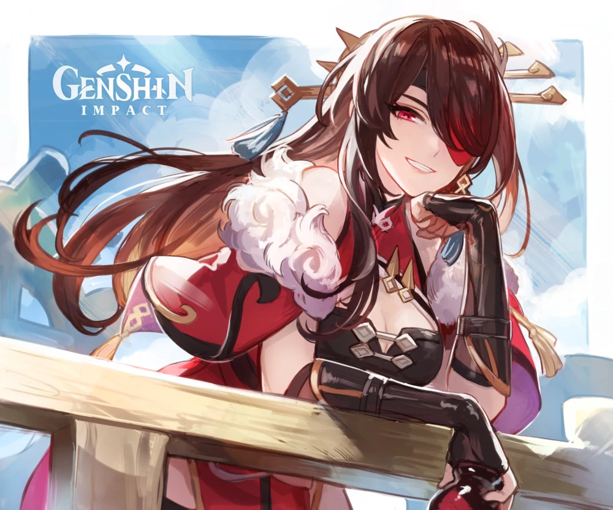

# Beidou


For a comprehensive Beidou guide, check out [ZΛNTO's guide.](https://docs.google.com/document/d/1LyhpgeCGv4GQ7MXuslgwb5lJgQ2GOrPMhIDSv2qARQo/edit?usp=sharing)


##  Beidou















## **Base Stats**

| Lv | Base HP | Base ATK | Base DEF | Electro DMG% |
| :--- | :--- | :--- | :--- | :--- |
| 60 | 8597 | 148 | 427 | 12 |
| 60+ | 9178 | 158 | 456 | 12 |
| 70 | 10081 | 174 | 501 | 12 |
| 70+ | 10662 | 184 | 530 | 18 |
| 80 | 11565 | 200 | 575 | 18 |
| 80+ | 12146 | 210 | 603 | 24 |
| 90 | 13050 | 225 | 648 | 24 |

## **Attacks**



**Normal Attacks**  
Beidou performs up to 5 consecutive attacks.

| String | Talent 6% | Frames | Motion Value |
| :--- | :--- | :--- | :--- |
| 1-Hit | 103.38% |  |  |
| 2-Hit | 103% |  |  |
| 3-Hit | 128.38% |  |  |
| 4-Hit | 125.75% |  |  |
| 5-Hit | 163% |  |  |

Normal attacks without **Lightning Storm** \(A4 passive\) active lose about 30% damage output.

* C0-C3 Beidou's should use N4 cancels or N5 dash cancels.

**Charged Attack**  
Beidou consumes 40 stamina a second to perform continuous slashes. At the end of the 5 seconds, perform a more powerful slash.

| String | Talent 6% | Frames | Motion Value |
| :--- | :--- | :--- | :--- |
| Slash | 81.75% |  |  |
| Final Slash | 148% |  |  |

**Plunge**

| Damage Type | Talent 6% |
| :--- | :--- |
| Plunge Impact | 108.41% |
| Low Plunge DMG | 216.78% |
| High Plunge DMG | 270.77% |

* Beidou can plunge from flat ground by using an R cancel to jump higher.
  * Enter and exit aimed mode, jump and attack in rapid succession.



**Press**  
Beidou swings her blade dealing Electro DMG.

**Hold**

* Lifts her weapon up as a shield, max DMG absorbed scaled off Beidou's max HP.
* Upon release, shield destruction, or max hold duration, Beidou will swing her blade once to deal Electro DMG.
* Damage dealt scales with the number of times Beidou is attacked during the skill's duration. Max DMG bonus is given if she is attacked twice.
* The shield posses 250% DMG absorption efficiency and applies Electro to Beidou upon activation.

| Type | Talent 6% | Cooldown | GU | Particles | Frames | Motion Value |
| :--- | :--- | :--- | :--- | :--- | :--- | :--- |
| Base DMG | 170.24% | 7.5s | 2B | 2 |  |  |
| Hold | 170.24% | 7.5s | 2B | 2~3 \(1:9\) |  |  |
| DMG Bonus on Hit Taken | 224% \(scaling\) |  |  | 3 |  |  |
| Shield Scaling | 20.16% Max HP + 2195 |  | 1A |  |  |  |

* Perfect parry information is tabulated in her [Ascension Passives](https://library.keqingmains.com/characters/electro/beidout#ascension-passives) table.



Beidou creates a **Thunderbeast's Targe** around herself, dealing Electro DMG to nearby opponents.

**Thunderbeast's Targe**

* When Normal and Charged Attacks hit, they create a lightning discharge that can jump between opponents, dealing Electro DMG.
* Increases active character’s resistance to interruption and decreases DMG taken.
* A maximum of 1 lightning discharge can be triggered per second.
* Snapshot on cast.

| Effect | Talent 6% / Data |
| :--- | :--- |
| Cast DMG | 170.24% |
| Lightning DMG | 134.4% |
| Lightning Bounces | 2 |
| DMG Reduction | 26% \(scaling\) |
| Duration | 15s |
| Cooldown | 20s |
| Energy Cost | 80 |
| Cast GU | 4C |
| Lightning GU | 1A |
| Frames |  |

* Beidou's lightning discharges have 3 damage instances with 2 targets or more.
* Stormbreaker's additional arc lightning can jump back to the initial target.



## **Ascension Passives**



### Conqueror of Tides

Decreases swimming Stamina consumption for your own party members by 20%

* Not stackable with Passive Talents that provide the exact same effects.



### Retribution

Counterattacking with Tidecaller at the precise moment when the character is hit grants the maximum DMG Bonus.

| Type | Talent 6% | Cooldown | GU | Particles | Frames | Motion Value |
| :--- | :--- | :--- | :--- | :--- | :--- | :--- |
| Full Counter | 618% | 7.5s | 2B | 4 |  |  |



### Lightning Storm

Gain the following effects for 10s after unleashing Tidecaller with its maximum DMG Bonus:

* DMG dealt by Normal and Charged Attacks is increased by 15%.
* ATK SPD of Normal and Charged Attacks is increased by 15%.
* Greatly reduced delay before unleashing charged attacks.



## Constellations



### Sea Beast's Scourge

When Stormbreaker is used, Beidou creates a shield that absorbs 16% of her Max HP for 15s.

* This shield absorbs Electro DMG 250% more effectively.



### Upon the Turbulent Sea, the Thunder Arises

Stormbreaker’s arc lightning can jump to 2 additional targets.



### Summoner of Storm

Increases the level of Tidecaller by 3.



### Stunning Revenge

Within 10s of taking DMG, Beidou’s Normal Attacks and Charged Attacks gain 20% additional Electro DMG.

* This is an echo effect.
* Use N2 cancels to maximize Electro DMG.



### Crimson Tidewalker

Increases the Level of Stormbreaker by 3.



### Bane of Evil

During the duration of Stormbreaker, the Electro RES of surrounding opponents is decreased by 15%.



## **Weapons**

### **Serpent Spine**

Perfect parrying does NOT reduce your Serpent Stacks. Any shield damage will not count as "taking damage," but if your shield breaks from an attack it will count as taking damage.

Serpent stacks still boost damage when off-field.

### The Bell

Tidecaller is effected by [The Bell's](https://library.keqingmains.com/mechanics/equipment/weapons/the-bell) 12% increased DMG on every cast.

### Rainslasher

The bonus damage against enemies afflicted with a Hydro or Electro aura is 8% more damage than The Bell using Tidecaller. Even when **Thunderbeast's Targe** is snapshot, the Rainslasher bonus damage still applies.

### The Unforged

Beidou's **Thunderbeast's Targe** is snapshot on-cast, but The Unforged has an ATK% bonus that changes when shielded. **Thunderbeast's Targe** is snapshot _before_ gaining the bonus from The Unforged's shield ATK% bonus.

## **External Links**

* [**Honey Hunter**](https://genshin.honeyhunterworld.com/db/char/beidou/)
* [**Genshin Impact Fandom**](https://genshin-impact.fandom.com/wiki/Beidou)
* [**Beidou Mains Discord**](https://discord.gg/qrjeEyejsd)

**Tags:** [Elemental Gauge Theory](https://library.keqingmains.com/mechanics/combat/elemental-reactions/elemental-gauge-theory), Shields

**Evidence Vault:**



