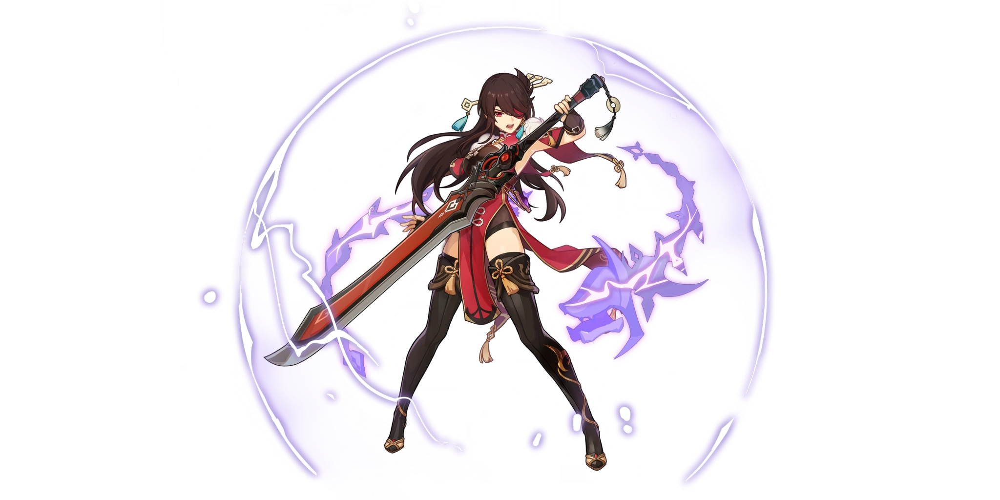

# Beidou

##  Beidou

## **Base Stats**

| Lv | Base HP | Base ATK | Base DEF | Electro DMG% |
| :--- | :--- | :--- | :--- | :--- |
| 60 | 8597 | 148 | 427 | 12 |
| 60+ | 9178 | 158 | 456 | 12 |
| 70 | 10081 | 174 | 501 | 12 |
| 70+ | 10662 | 184 | 530 | 18 |
| 80 | 11565 | 200 | 575 | 18 |
| 80+ | 12146 | 210 | 603 | 24 |
| 90 | 13050 | 225 | 648 | 24 |

## **Attacks**



**Normal Attacks**  
Beidou performs up to 5 consecutive attacks.

| String | Talent 6% | Frames | Motion Value |
| :--- | :--- | :--- | :--- |
| 1-Hit | 103.38% | 23 | 269.7%/s |
| 2-Hit | 103% | 66 | 187.6%/s |
| 3-Hit | 128.38% | 134 | 149.9%/s |
| 4-Hit | 125.75% | 178 | 155.2%/s |
| 5-Hit | 163% | 246 | 152.1%/s |

Normal attacks without **Lightning Storm** \(A4 passive\) active lose about 30% damage output.

* C0-C3 Beidou's should use N4 cancels or N5 dash cancels.
* Beidou's normal attack string concludes with a kick to the sword with her foot. Whether her model makes contact with the claymore depends on the model size of the claymore. We can conclude that it is intended to be a kick to the claymore because a sound will play no matter what model size the claymore.

**Charged Attack**  
Beidou consumes 40 stamina a second to perform continuous slashes. At the end of the 5 seconds, perform a more powerful slash.

| String | Talent 6% | Frames | Motion Value |
| :--- | :--- | :--- | :--- |
| Slash | 81.75% | 35 | 140.1%/s |
| Final Slash | 148% | 32 | 277.5%/s |

* Charged Attack wind up is 71 frames long.
* All frame counts are done against a Ruin Guard

**Plunge**

| Damage Type | Talent 6% |
| :--- | :--- |
| Plunge Impact | 108.41% |
| Low Plunge DMG | 216.78% |
| High Plunge DMG | 270.77% |



**Press**  
Beidou swings her blade dealing Electro DMG.

**Hold**

* Lifts her weapon up as a shield, max DMG absorbed scaled off Beidou's max HP.
* Upon release, shield destruction, or max hold duration, Beidou will swing her blade once to deal Electro DMG.
* Damage dealt scales with the number of times Beidou is attacked during the skill's duration. Max DMG bonus is given if she is attacked twice.
* The shield posses 250% DMG absorption efficiency and applies Electro to Beidou upon activation.

| Type | Talent 6% | Cooldown | GU | Particles | Frames | Motion Value |
| :--- | :--- | :--- | :--- | :--- | :--- | :--- |
| Base DMG | 170.24% | 7.5s | 2B | 2 | 41 | 249.1%/s |
| Hold | 170.24% | 7.5s | 2B | 2~4 | ~ | ~ |
| DMG Bonus on Hit Taken | 224% \(scaling\) | ~ | ~ | 3 | ~ | ~ |
| Shield Scaling | 20.16% Max HP + 2195 | ~ | 1A | ~ | ~ | ~ |

* **Tidecaller** will produce minimum 2 particles, if you get hit once while holding\(one charge\) it produces 3 particles and if you get hit two times\(two charges\) or perform a **perfect parry** it will produce 4 particles.
* **Perfect parry** information is tabulated in her [Ascension Passives](beidou.md#ascension-passives) table.




Beidou creates a **Thunderbeast's Targe** around herself, dealing Electro DMG to nearby opponents.

**Thunderbeast's Targe**

* When Normal and Charged Attacks hit, they create a lightning **discharge** that can jump between opponents, dealing Electro DMG.
* Increases active character’s resistance to interruption and decreases DMG taken.
* A maximum of 1 lightning **discharge** can be triggered per second.
* Snapshot on cast.
  * However, if you swap to Beidou and cast her Burst too quick (Left Alt + Switch Character), her Lightning DMG might fail to snapshot certain buffs.

| Effect | Talent 6% / Data |
| :--- | :--- |
| Cast DMG | 170.24% |
| Lightning DMG | 134.4% |
| Lightning Bounces | 2 |
| DMG Reduction | 26% \(scaling\) |
| Duration | 15s |
| Cooldown | 20s |
| Energy Cost | 80 |
| Cast GU | 4C |
| Lightning GU | 1A |
| Frames | 45 |

* Beidou's **lightning discharges** have 3 damage instances with 2 targets or more.
* **Stormbreaker**'s additional arc lightning can jump back to the initial target.




## **Ascension Passives**



### Conqueror of Tides

Decreases swimming Stamina consumption for your own party members by 20%

* Not stackable with Passive Talents that provide the exact same effects.




### Retribution

Counterattacking with **Tidecaller** at the precise moment when the character is hit grants the maximum DMG Bonus.

| Type | Talent 6% | Cooldown | GU | Particles | Frames | Motion Value |
| :--- | :--- | :--- | :--- | :--- | :--- | :--- |
| Full Counter | 618% | 7.5s | 2B | 4 |  |  |



### Lightning Storm

Gain the following effects for 10s after unleashing **Tidecaller** with its maximum DMG Bonus:

* DMG dealt by Normal and Charged Attacks is increased by 15%.
* ATK SPD of Normal and Charged Attacks is increased by 15%.
* Greatly reduced delay before unleashing charged attacks.




## Constellations



### Sea Beast's Scourge

When **Stormbreaker** is used, Beidou creates a shield that absorbs 16% of her Max HP for 15s.

* This shield absorbs Electro DMG 250% more effectively.




### Upon the Turbulent Sea, the Thunder Arises

**Stormbreaker**’s arc **lightning discharges** can jump to 2 additional targets.



### Summoner of Storm

Increases the level of **Tidecaller** by 3.



### Stunning Revenge

Within 10s of taking DMG, Beidou’s Normal Attacks and Charged Attacks gain 20% additional Electro DMG echo that applies 1A Electro.

| Name | GUs |
| :--- | :--- |
| Stunning Revenge | 1A |

* Use N2 cancels to maximize Electro DMG.
* Beidou’s C4 damage instance is considered skill damage. 
* C4 can be activated by certain teammate's hit, i.e., Kujou Sara's Tengou Juurai.
* C4 is activated on hit, regardless taking damage or not. So it can be activated through shields, either her own or allies'.




### Crimson Tidewalker

Increases the Level of **Stormbreaker** by 3.



### Bane of Evil

During the duration of **Stormbreaker**, the Electro RES of surrounding opponents is decreased by 15%.



## **Weapons**

### **Serpent Spine**

Perfect parrying does NOT reduce your Serpent Stacks. Any shield damage will not count as "taking damage," but if your shield breaks from an attack it will count as taking damage.

Serpent stacks still boost damage when off-field.

### The Bell

Tidecaller is affected by [The Bell's](../../mechanics/equipment/weapons/claymores.md#the-bell) 12% increased DMG on every cast.

### Rainslasher

The bonus damage against enemies afflicted with a Hydro or Electro aura is 8% more damage than The Bell using **Tidecaller**. Even when **Thunderbeast's Targe** is snapshot, the Rainslasher bonus damage still applies.

### The Unforged

Beidou's **Thunderbeast's Targe** is snapshot on-cast, but The Unforged has an ATK% bonus that changes when shielded. **Thunderbeast's Targe** is snapshot _before_ gaining the bonus from The Unforged's shield ATK% bonus.

## Full Talent Values



### Normal Attacks

|  | Lv6 | Lv7 | Lv8 | Lv9 | Lv10 | Lv11 |
| :--- | :--- | :--- | :--- | :--- | :--- | :--- |
| 1-Hit DMG | 103.38 | 112.47 | 121.57 | 130.67 | 140.59 | 151.96 |
| 2-Hit DMG | 103 | 112.06 | 121.13 | 130.19 | 140.08 | 151.41 |
| 3-Hit DMG | 128.38 | 139.67 | 150.97 | 162.27 | 174.59 | 188.71 |
| 4-Hit DMG | 125.75 | 136.82 | 147.88 | 158.95 | 171.02 | 184.85 |
| 5-Hit DMG | 163 | 177.34 | 191.69 | 206.03 | 221.68 | 239.61 |

### Charged Attack

|  | Lv6 | Lv7 | Lv8 | Lv9 | Lv10 | Lv11 |
| :--- | :--- | :--- | :--- | :--- | :--- | :--- |
| Charged Attack Spinning DMG | 81.75 | 88.94 | 96.14 | 103.33 | 111.18 | 120.17 |
| Charged Attack Final DMG | 148 | 161.02 | 174.05 | 187.07 | 201.28 | 217.56 |

**Maximum Duration**: 5s

**Stamina Cost**: 40

### Plunge

|  | Lv6 | Lv7 | Lv8 | Lv9 | Lv10 | Lv11 |
| :--- | :--- | :--- | :--- | :--- | :--- | :--- |
| Plunge DMG | 108.41 | 117.95 | 127.49 | 137.03 | 147.44 | 157.85 |
| Low Plunge DMG | 216.78 | 235.86 | 254.93 | 274.01 | 294.82 | 315.63 |
| High Plunge DMG | 270.77 | 294.60 | 318.42 | 342.25 | 368.25 | 394.24 |



|  | Lv6 | Lv7 | Lv8 | Lv9 | Lv10 | Lv11 | Lv12 | Lv13 |
| :--- | :--- | :--- | :--- | :--- | :--- | :--- | :--- | :--- |
| Shield DMG Absorption Scaling | 20.16 | 21.6 | 23.04 | 24.48 | 25.92 | 27.36 | 28.8 | 30.6 |
| Shield DMG Absorption | 2195 | 2392 | 2600 | 2819 | 3050 | 3293 | 3547 | 3813 |
| Base DMG | 170.24 | 182.40 | 194.56 | 206.72 | 218.88 | 231.04 | 243.20 | 258.40 |
| DMG Bonus on Hit Taken | 224 | 240 | 256 | 272 | 288 | 304 | 320 | 340 |

**Cooldown**: 7.5s



|  | Lv6 | Lv7 | Lv8 | Lv9 | Lv10 | Lv11 | Lv12 | Lv13 |
| :--- | :--- | :--- | :--- | :--- | :--- | :--- | :--- | :--- |
| Skill DMG | 170.24 | 182.40 | 194.56 | 206.72 | 218.88 | 231.04 | 243.20 | 258.40 |
| Lightning DMG | 134.40 | 144 | 153.60 | 163.20 | 172.80 | 182.40 | 192 | 204 |
| DMG Reduction | 26 | 28 | 30 | 32 | 34 | 35 | 36 | 37 |

**Energy Cost**: 80

**Duration**: 15s

**Cooldown**: 20s



## **External Links**

* [Genshin Impact Fandom](https://genshin-impact.fandom.com/wiki/Beidou)
* [Beidou Mains Discord](https://discord.gg/rgS2f9dBxb)
* [Full Beidou Written Guide: Tales from the Sea](https://keqingmains.com/beidou/)
* [6 Minute Quick Guide to Beidou](https://youtu.be/AWlLidtFiDw)

**Evidence Vault:**



