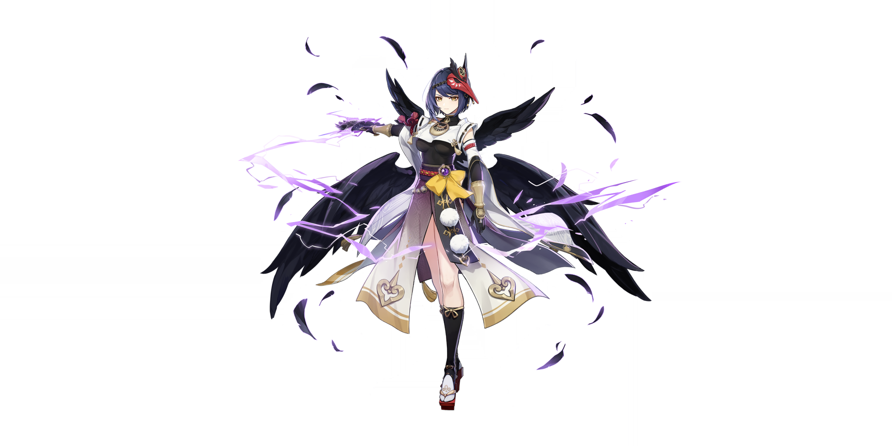

# Sara

## **External Links**
[Short Sara Guide](https://keqingmains.com/sara/)

##  Kujou Sara

## **Base Stats**

| Lv | Base HP | Base ATK | Base DEF | ATK |
| :--- | :--- | :--- | :--- | :--- |
| 60 | 6305 | 129 | 414 | 12% |
| 60+ | 6731 | 137 | 442 | 12% |
| 70 | 7393 | 151 | 485 | 12% |
| 70+ | 7818 | 160 | 513 | 18% |
| 80 | 8481 | 173 | 556 | 18% |
| 80+ | 8907 | 182 | 584 | 24% |
| 90 | 9570 | 195 | 628 | 24% |

## **Attacks**



**Normal Attacks**  
Perform up to 5 consecutive shots with a bow.

| String | Talent 6% | Frames | MV/s |
| :--- | :--- | :--- | :--- |
| 1-Hit DMG | 53.63% | 19 | 169.36%/s |
| 2-Hit DMG | 56.25% | 44 | 149.84%/s |
| 3-Hit DMG | 70.5% | 82 | 131.99%/s |
| 4-Hit DMG | 73.25% | 123 | 123.72%/s |
| 5-Hit DMG | 84.38% | 181 | 112.05%/s |
| Recovery | -- | 195 | 104.00%/s |

**Charged Attacks**  
Perform a more precise Aimed Shot with increased DMG.  
While aiming, crackling lightning will accumulate on the arrowhead. An arrow fully charged with the storm's might will deal Electro DMG.  
When in the **Crowfeather Cover** state, a fully-charged arrow will leave a **Crowfeather** behind after it hits.

| String | Talent 6% | Frames | MV/s | GU |
| :--- | :--- | :--- | :--- | :--- |
| Aimed Shot | 63.75% | 38 | 100.65%/s | -- |
| Fully-Charged Aimed Shot | 173.6% | 78 | 137.05%/s | 1A |

**Plunge Attacks**  
Fires off a shower of arrows in mid-air before falling and striking the ground, dealing AoE DMG upon impact.

| String | Talent 6% |
| :--- | :--- |
| Plunge DMG | 82.6% |
| Low Plunge DMG | 165.17% |
| High Plunge DMG | 206.3% |




Retreats rapidly with the speed of a tengu, summoning the protection of the Crowfeather.  
Gains **Crowfeather Cover** for 18s, and when Kujou Sara fires a fully-charged Aimed Shot, **Crowfeather Cover** will be consumed, and will leave a **Crowfeather** at the target location.

**Crowfeathers** will trigger **Tengu Juurai: Ambush** after a short time, dealing Electro DMG and granting the active character within its AoE an ATK Bonus based on Kujou Sara's Base ATK.  
The ATK Bonuses from different **Tengu Juurai** will not stack, and their effects and duration will be determined by the last **Tengu Juurai** to take effect.

| Attribute | Skill |
| :--- | :--- |
| Skill DMG \(T6%\) | 176.06% |
| ATK Bonus Ratio \(T6%\) | 60.14% |
| ATK Bonus Duration | 6s |
| Particles | 3 |
| Frames | 50 |
| GU | 1A |
| ICD (hits/timer) | None |
| Snapshot | Snapshot |
| Damage Element | Electro |
| Damage Type | Skill |
| Duration | 18s |
| CD | 10s |

**Notes**
* **Tengu Stormcall** only buffs the on-field characters the frame before the Crowfeather Explosion, this also applies to coop members.
* Triggering **Tengu Juurai: Ambush** doesn't require hitting an enemy, just a fully-charged aimed shot.
* **Tengu Juurai: Ambush** DMG is snapshot upon **Tengu Stormcall** cast.
* Sara does not lose the effects of **Crowfeather Cover** if swapped off.
* **Crowfeather** does not stick to walls; it sticks to the closest walkable surface from the point of collision.
* A fully-charged aimed shot fired with **Crowfeather Cover** will disappear after 2 seconds in flight.
* **Crowfeather** triggers **Tengu Juurai: Ambush** 1.5s after landing.
* **Crowfeather** has a "semi-taunt" mechanic, where it can draw enemy attention even while not in combat mode.
* The hitbox to gain an ATK buff from **Tengu Juurai: Ambush** is massive vertically.
* The damage hitbox of **Tengu Juurai: Ambush** is different from the hitbox to gain an ATK Buff.
* **Tengu Juurai: Ambush** is a unique "friendly fire" attack and can trigger several other characters's perks that require getting hit.
* When Sara is near an enemy, **Tengu Stormcall** will teleport her away from them. 
* When Sara is not near any enemies, **Tengu Stormcall** will teleport her backwards. The player can also choose to control the teleport by inputting a direction before the teleport occurs.  




Casts down **Tengu Juurai: Titanbreaker**, dealing AoE Electro DMG. Afterwards, **Tengu Juurai: Titanbreaker** spreads out into 4 consecutive bouts of **Tengu Juurai: Stormcluster,** dealing AoE Electro DMG.

**Tengu Juurai: Titanbreaker** and **Tengu Juurai: Stormcluster** can provide the active character within their AoE with the same ATK Bonus as given by the Elemental Skill, **Tengu Stormcall**.  
The ATK Bonus provided by various kinds of **Tengu Juurai** will not stack, and their effects and duration will be determined by the last **Tengu Juurai** to take effect.

| Attribute | Burst |
| :--- | :--- |
| Titanbreaker DMG \(T6%\) | 573.44% | 1A |
| Stormcluster DMG \(T6%\) | 47.77% (each) | 1A |
| Frames | 80 (60 with swap) |
| GU | 1A |
| ICD (hits/timer) | 3 hit/2.5s |
| Snapshot | Snapshot |
| Damage Element | Electro |
| Damage Type | Burst |
| Energy Cost | 80 |
| CD | 20s |

**Notes**
* The cast frames of **Subjugation: Koukou Sendou** can be reduced to 60 with a swap cancel
* **Titanbreaker** and **Stormcluster** do not share ICDs.
* Both **Titanbreaker** and **Stormcluster** damage is snapshot on **Subjugation: Koukou Sendou** cast.
* For Sara's ATK bonus to apply, a character has to be in a radius of the initial **Titanbreaker** hit equal to the range of the **Stormcluster** hits.
* **Titanbreaker** targets closest enemy, then **Stormcluster** moves outward in a plus-shape with one branch directed at Sara’s location at time of cast.
*  **Subjugation: Koukou Sendou** does not benefit from its own attack bonus.




## **Ascension Passives**



### **Land Survey**

When dispatched on an expedition in Inazuma, time consumed is reduced by 25%.



### **Immovable Will**

While in the **Crowfeather Cover** state provided by **Tengu Stormcall**, Aimed Shot charge times are decreased by 60%.



### **Decorum**

When **Tengu Juurai: Ambush** hits opponents, Kujou Sara will restore 1.2 Energy to all party members for every 100% Energy Recharge she has. This effect can be triggered once every 3s.

* The weaker Crowfeather from C2 can also trigger this effect.  
* The amount of Energy Sara restores with Decorum scales directly with her Energy Recharge. You do not need to hit 100% Energy Recharge increments to restore more Energy.




## **Constellations**



### **Crow's Eye**

When **Tengu Juurai** grant characters ATK Bonuses or hits opponents, the CD of **Tengu Stormcall** is decreased by 1s. This effect can be triggered once every 3s.



### **Dark Wings**

Unleashing **Tengu Stormcall** will leave a **Weaker Crowfeather** at Kujou Sara's original position that will deal 30% of its original DMG.

| Type | Talent 6% |
| :--- | :--- |
| DMG | 176.06% * 0.3 |
| GU | 1A |
| Damage Type | Elemental Skill |

* The **Weaker Crowfeather** applies 1A Electro and has separate ICD from **Tengu Stormcall**.
* **Weaker Crowfeather** snapshots upon **Tengu Stormcall** cast.
* The **Weaker Crowfeather** formed can trigger the effects of Sara's A4.



### **The War Within**

Increases the Level of **Subjugation: Koukou Sendou** by 3.  
Maximum upgrade level is 15.



### **Conclusive Proof**

The number of **Tengu Juurai: Stormcluster** released by **Subjugation: Koukou Sendou** is increased to 6.



### **Spellsinger**

Increases the Level of **Tengu Stormcall** by 3.  
Maximum upgrade level is 15.



### **Sin of Pride**

The Electro DMG of characters who have had their ATK increased by **Tengu Juurai** has its Crit DMG increased by 60%.

* The effects of **Sin of Pride** do not get snapshot.



## **Full Talent Values**


### Normal Attacks

|  | Lv6 | Lv7 | Lv8 | Lv9 | Lv10 | Lv11 |
| :--- | :--- | :--- | :--- | :--- | :--- | :--- |
| 1-Hit DMG | 53.63% | 58.34% | 63.06% | 67.78% | 72.93% | 78.08% |
| 2-Hit DMG | 56.25% | 61.2% | 66.15% | 71.1% | 76.5% | 81.9% |
| 3-Hit DMG | 70.5% | 76.7% | 82.91% | 89.11% | 95.88% | 102.65% |
| 4-Hit DMG | 73.25% | 79.7% | 86.14% | 92.59% | 99.62% | 106.65% |
| 5-Hit DMG | 84.38% | 91.8% | 99.23% | 106.65% | 114.75% | 122.85% |

### Charged Attack

|  | Lv6 | Lv7 | Lv8 | Lv9 | Lv10 | Lv11 |
| :--- | :--- | :--- | :--- | :--- | :--- | :--- |
| Aimed Shot | 63.75% | 69.36% | 74.97% | 80.58% | 86.7% | 92.82% |
| Fully-Charged Aimed Shot | 173.6% | 186% | 198.4% | 210.8% | 223.2% | 235.6% |

### Plunge 

|  | Lv6 | Lv7 | Lv8 | Lv9 | Lv10 | Lv11 |
| :--- | :--- | :--- | :--- | :--- | :--- | :--- |
| Plunge DMG | 82.6% | 89.87% | 97.14% | 104.41% | 112.34% | 120.27% |
| Low Plunge DMG | 165.17% | 179.7% | 194.23% | 208.77% | 224.62% | 240.48% |
| High Plunge DMG | 206.3% | 224.45% | 242.61% | 260.76% | 280.57% | 300.37% |



|  | Lv6 | Lv7 | Lv8 | Lv9 | Lv10 | Lv11 | Lv12 | Lv13 |
| :--- | :--- | :--- | :--- | :--- | :--- | :--- | :--- | :--- |
| Tengu Juurai: Ambush DMG | 176.06% | 188.64% | 201.22% | 213.79% | 226.37% | 238.94% | 251.52% | 267.24% |
| ATK Bonus Ratio | 60.14% | 64.44% | 68.74% | 73.03% | 77.33% | 81.62% | 85.92% | 91.29% |

**ATK Bonus Duration:** 6s  
**Cooldown:** 10 s




|  | Lv6 | Lv7 | Lv8 | Lv9 | Lv10 | Lv11 | Lv12 | Lv13 |
| :--- | :--- | :--- | :--- | :--- | :--- | :--- | :--- | :--- |
| Tengu Juurai: Titanbreaker DMG | 573.44% | 614.4% | 655.36% | 696.32% | 737.28% | 778.24% | 819.2% | 870.4% |
| Tengu Juurai: Stormcluster DMG | 47.77% | 51.18% | 54.59% | 58% | 61.42% | 64.83% | 68.24% | 72.51% |

**Cooldown:** 20s  
**Energy Cost:** 80




## Evidence Vault


