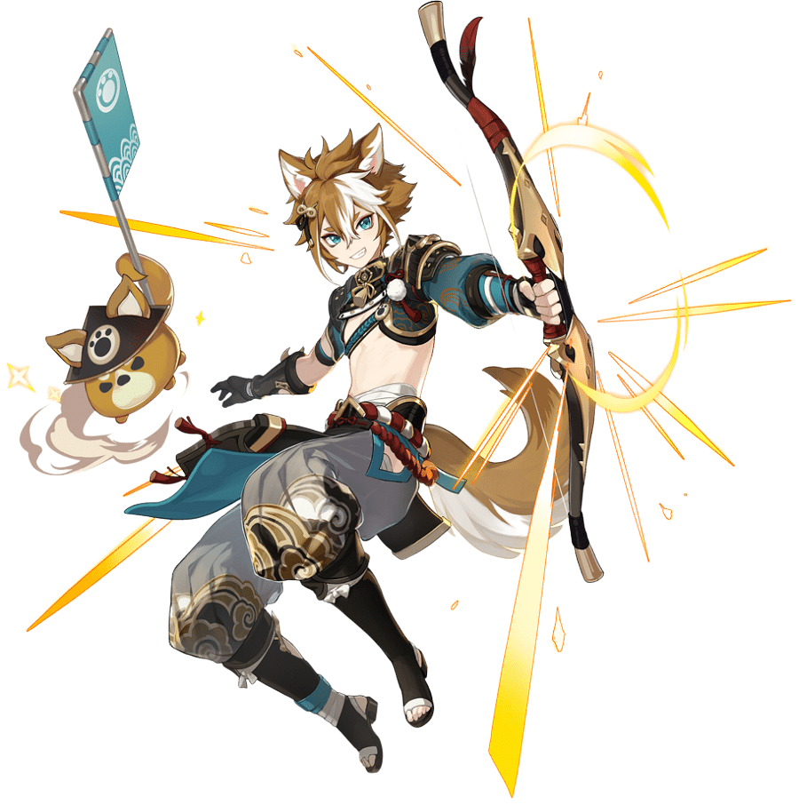

# Gorou

##  Gorou

## **Base Stats**

| Lv | Base HP | Base ATK | Base DEF | Geo DMG Bonus |
| :--- | :--- | :--- | :--- | :--- |
| 60 | 6305 | 120 | 427 | 12% |	
| 60+ | 6731 | 128 | 456 | 12% |
| 70 | 7393 | 141 | 501 | 12% |
| 70+ | 7818 | 149 | 530 | 18% |
| 80 | 8481 | 162 | 575 | 18% |
| 80+ | 8907 | 170 | 603 | 24% |
| 90 | 9570 | 183 | 648 | 24% |

## **Attacks**



**Normal Attacks**  
Perform up to 4 consecutive shots with a bow.

| String | Talent 6% | Frames | MV/s |
| :--- | :--- | :--- | :--- |
| 1-Hit | 54.88% | - | - |
| 2-Hit | 54% | - | - |
| 3-Hit | 71.88% | - | - |
| 4-Hit | 85.75% | - | - |

**Charged Attack**  
Perform a more precise Aimed Shot with increased DMG.
While aiming, stone crystals will accumulate on the arrowhead. A fully charged crystalline arrow will deal Geo DMG.

| String | Talent 6% | Frames | MV/s |
| :--- | :--- | :--- | :--- |
| Aimed Shot | 63.75% | - | - |
| Fully-Charged Aimed Shot | 173.6% | - | - |

**Plunge**  
Fires off a shower of arrows in mid-air before falling and striking the ground, dealing AoE DMG upon impact.

| Damage Type | Talent 6% |
| :--- | :--- |
| Plunge Impact | 82.6% |
| Low Plunge DMG | 165.17% |
| High Plunge DMG | 206.3% |


  
Deals AoE Geo DMG and sets up a **General's War Banner**.  

**General's War Banner**  
Provides up to 3 buffs to active characters within the skill's AoE based on the number of Geo characters in the party at the time of casting:
* 1 Geo character: Adds "**Standing Firm**" - DEF Bonus.
* 2 Geo characters: Adds "**Impregnable**" - Increased resistance to interruption.
* 3 Geo characters: Adds "**Crunch**" - Geo DMG Bonus.
Gorou can deploy only 1 **General's War Banner** on the field at any one time. Characters can only benefit from 1 **General's War Banner** at a time. When a party member leaves the field, the active buff will last for 2s.

**Hold**
Adjust the location of the skill.

| Attribute | War Banner | 
| :--- | :--- |
| Skill DMG \(T6%\) | 150.08% |
| DEF Increase \(T6%\) | 289 |
| Geo DMG Bonus | 15% |
| Particles | - | 
| Frames | - |
| GU | - |
| ICD | - | 
| Snapshot | - | 
| Damage Element | Geo | 
| Damage Type | Skill |
| Duration | 10s |
| CD | 10s | 




Displaying his valor as a general, Gorou deals AoE Geo DMG and creates a field known as General's Glory to embolden his comrades.  
**General's Glory**  
This field has the following properties:
* Like the **General's War Banner** created by **Inuzaka All-Round Defense**, provides buffs to active characters within the skill's AoE based on the number of Geo characters in the party. Also moves together with your active character.
* Generates 1 **Crystal Collapse** every 1.5s that deals AoE Geo DMG to 1 opponent within the skill's AoE.
* Pulls 1 elemental shard in the skill's AoE to your active character's position every 1.5s (elemental shards are created by Crystallize reactions).  
If a **General's War Banner** created by Gorou currently exists on the field when this ability is used, it will be destroyed. In addition, for the duration of **General's Glory**, Gorou's Elemental Skill "**Inuzaka All-Round Defense**" will not create the **General's War Banner**.  
If Gorou falls, the effects of **General's Glory** will be cleared.

| Attribute | Burst | Crystal Collapse | 
| :--- | :--- | :--- |
| Skill DMG \(T6%\) | 137.5% DEF | 85.82% DEF | 
| Frames | - | - |
| GU | - | - |
| ICD | - | - | 
| Snapshot | - | - | 
| Damage Element | Geo | - | 
| Damage Type | Burst | - |
| Energy Cost | 80 | - |
| Duration | 9s | - |
| CD | 20s | - |




## **Ascension Passives**



### Seeker of Shinies

Displays the location of nearby resources unique to Inazuma on the mini-map.



### Heedless of the Wind and Weather

After using **Juuga: Forward Unto Victory**, all nearby party members' DEF is increased by 25% for 12s.



### A Favor Repaid

Gorou receives the following DMG Bonuses to his attacks based on his DEF:
* **Inuzaka All-Round Defense**: Skill DMG increased by 156% of DEF
* **Juuga: Forward Unto Victory**: Skill DMG and Crystal Collapse DMG increased by 15.6% of DEF



## **Constellations**



### Rushing Hound: Swift as the Wind

When characters (other than Gorou) within the AoE of Gorou's **General's War Banner** or **General's Glory** deal Geo DMG to opponents, the CD of Gorou's **Inuzaka All-Round Defense** is decreased by 2s.  
This effect can occur once every 10s.



### Sitting Hound: Steady as a Clock

While **General's Glory** is in effect, its duration is extended by 1s when a nearby active character obtains an Elemental Shard from a Crystallize reaction.  
This effect can occur once every 0.1s. Max extension is 3s.




### Mauling Hound: Fierce as Fire

Increases the Level of **Inuzaka All-Round Defense** by 3.



### Lapping Hound: Warm as Water

When **General's Glory** is in the "**Impregnable**" or "**Crunch**" states, it will also heal active characters within its AoE by 50% of Gorou's own DEF every 1.5s.



### Striking Hound: Thunderous Force

Increases the Level of **Juuga: Forward Unto Victory** by 3.



### Valiant Hound: Mountainous Fealty

For 12s after using **Inuzaka All-Round Defense** or **Juuga: Forward Unto Victory**, increases the CRIT DMG of all nearby party members' Geo DMG based on the buff level of the skill's field at the time of use:
* "**Standing Firm**": +10%
* "**Impregnable**": +20%
* "**Crunch**": +40%

This effect cannot stack and will take reference from the last instance of the effect that is triggered.



## **Full Talent Values**



### Normal Attacks

|  | Lv6 | Lv7 | Lv8 | Lv9 | Lv10 | Lv11 |
| :--- | :--- | :--- | :--- | :--- | :--- | :--- |
| 1-Hit DMG | 54.88% | 59.70% | 64.53% | 69.36% | 74.63% | 79.90% |
| 2-Hit DMG | 54% | 58.75% | 63.50% | 68.26% | 73.44% | 78.62% |
| 3-Hit DMG | 71.88% | 78.20% | 84.53% | 90.85% | 97.75% | 104.65% |
| 4-Hit DMG | 85.75% | 93.30% | 100.84% | 108.39% | 116.62% | 124.85% |

### Charged Attack

|  | Lv6 | Lv7 | Lv8 | Lv9 | Lv10 | Lv11 |
| :--- | :--- | :--- | :--- | :--- | :--- | :--- |
| Aimed Shot | 63.75% | 69.36% | 74.97% | 80.58% | 86.70% | 92.82% |
| Fully-Charged Aimed Shot | 173.60% | 186% | 198.40% | 210.80% | 223.20% | 235.60% |

### Plunge

|  | Lv6 | Lv7 | Lv8 | Lv9 | Lv10 | Lv11 |
| :--- | :--- | :--- | :--- | :--- | :--- | :--- |
| Plunge DMG | 82.60% | 89.87% | 97.14% | 104.41% | 112.34% | 120.27% |
| Low Plunge DMG 165.17% | 179.7% | 194.23% | 208.77% | 224.62% | 240.48% |
| High Plunge DMG | 206.3% | 224.45% | 242.61% | 260.76% | 280.57% | 300.37% |




|  | Lv6 | Lv7 | Lv8 | Lv9 | Lv10 | Lv11 | Lv12 | Lv13 |
| :--- | :--- | :--- | :--- | :--- | :--- | :--- | :--- | :--- |
| Skill DMG | 150.08% | 160.80% | 171.52% | 182.24% | 192.96% | 203.68% | 214.40% | 227.80% |
| DEF Increase | 289 | 309 | 330 | 350 | 371 | 392 | 412 | 438 |

**Geo Damage Bonus**: 10%  
**Duration**: 10s  
**Cooldown**: 10s



|  | Lv6 | Lv7 | Lv8 | Lv9 | Lv10 | Lv11 | Lv12 | Lv13 |
| :--- | :--- | :--- | :--- | :--- | :--- | :--- | :--- | :--- |
| Skill DMG | 137.5% DEF | 147.32% DEF | 157.15% DEF | 166.97% DEF | 176.79% DEF | 186.61% DEF | 196.43% DEF | 208.71% DEF |
| Crystal Collapse DMG | 85.82% DEF | 91.95% DEF | 98.08% DEF | 104.21% DEF | 110.34% DEF | 116.47% DEF | 122.6% DEF | 130.26% DEF |

**Energy Cost**: 80  
**Duration**: 9s  
**Cooldown**: 20s  



## Evidence Vault:

