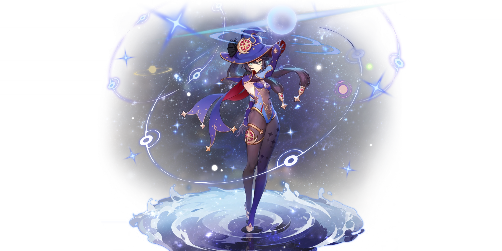

# Mona

## **Resources**

* [Mona Mains Discord](https://discord.gg/uxVEDkTyRe)
* [Full Mona Written Guide: The Astrological Guide to Mona Megistus](https://keqingmains.com/mona/)
* [Optimal Mona Attack String](../../evidence/characters/hydro/mona.md#what-attack-string-combo-outputs-the-highest-dps-for-mona) by Baezal\#0868
* [Mona Omen Extension Explained](../../evidence/characters/hydro/mona.md#mona-omen-extension-extended) by Gibbigobo\#9750(aka LACola)

##  Mona

## **Base Stats**

| Lv | Base HP | Base ATK | Base DEF | Energy Recharge% |
| :--- | :--- | :--- | :--- | :--- |
| 60 | 6752 | 186 | 424 | 16 |
| 60+ | 7246 | 200 | 455 | 16 |
| 70 | 7964 | 220 | 500 | 16 |
| 70+ | 8458 | 233 | 531 | 24 |
| 80 | 9184 | 253 | 576 | 24 |
| 80+ | 9677 | 267 | 607 | 32 |
| 90 | 10409 | 287 | 653 | 32 |

## **Attacks**



**Normal Attack**  
Perform up to 4 water splash attacks that deal Hydro DMG.

| String | Talent 6% | Frames | MV/s | GU |
| :--- | :--- | :--- | :--- | :--- |
| 1-Hit | 52.64% | 18 | 175.5%/s | 1A |
| 2-Hit | 50.4% | 41 | 150.8%/s | 1A |
| 3-Hit | 62.72% | 74 | 134.4%/s | 1A |
| 4-Hit | 78.62% | 113 | 129.8%/s | 1A |
| With Recovery | 244.38% | 154 | 95.2%/s | 1A |

* Frame counts are done using M1 Spams.
* Mona's 3rd Normal Attack has 2 different animations. She will either jump backwards or forward depending on the position of her target.
* 3 hits / 2.5s ICD

**Charged Attack**  
Consume 50 Stamina to deal AoE Hydro damage after a short casting time.

| String | Talent 6% | Frames | MV/s | GU |
| :--- | :--- | :--- | :--- | :--- |
| Charged Attack | 209.61% | 107 | 117.5% | 1A |
| N2C | 312.65% | 141 | 133% | ~ |
| N3C | 375.37% | 197 | 114.3% | ~ |

* Charged Attack frame counts are done using Timed M1 Spams
* N2C and N3C frame counts are done using the same method without Jump Cancels.
* 0.5s ICD

**Plunge Attack**  
Plunge from mid-air to the ground, dealing AoE Hydro DMG.

| Type | Talent 6% | GU |
| :--- | :--- | :--- |
| Plunge DMG | 82.6% | 1A |
| Low Plunge DMG | 165.1% | 1A |
| High Plunge DMG | 206.3% | 1A |




**Press**  
Creates an illusory **Phantom of Fate** with the following special properties:

* Continuously taunts nearby opponents
* Continuously deal Hydro DMG to nearby opponents.
* When its duration expires, the **Phantom** explodes, dealing AoE Hydro DMG.

**Hold**  
Mona dashes backwards before placing a **Phantom of Fate** down.

* Only one **Phantom** created by **Mirror Reflection of Doom** can exist at any time.
* Mona's Holding version of **Mirror Reflection of Doom** has invincibility frames that can be utilized for dodging.

| Attribute | DoT | Explosion |
| :--- | :--- | :--- 
| Skill DMG \(T6%\) | 44.8% | 185.92% |
| Tick Rate | 1/s | - |
| Particles | - |  3~4 \(2:1\) |
| Frames | 42 | - | 
| GU | 1A | 1B | 
| ICD | 3 hits / 2.5s | None |
| Snapshot | Snapshot | Snapshot |
| Damage Element | Hydro | Hydro |
| Damage Type | Skill | Skill |
| Duration | 5s | - |
| CD | 12s | - |

* Mona can dash before **Mirror Reflection of Doom** finishes casting, which leads to no **Phantom** being created.
* **Mirror Reflection of Doom** will cause five instances of damage. It will tick 4 times, dealing DoT damage, then explode to deal Explosion DMG.
* Applies Hydro on cast




**Alternate Sprint**  
Mona cloaks herself within the water’s flow, consuming Stamina to move rapidly.  

* When under the effect of **Illusory Torrent**, Mona can sprint on water.
* Applies Hydro aura to nearby opponents when she reappears.

| Attribute | Values |
| :--- | :--- |
| Activation Stamina Cost | 10 |
| Stamina Drain | 15/s |
| Hydro Application GU | 1A |
| ICD | 3 hits / 2.5s |

* **Illusory Torrent** isn't affected by stamina reduction passives from Kaeya or Razor
* **Illusory Torrent** holds priority over Mona's skill, meaning that if you dash before Mona's skill is finished casting, the skill cast will be cancelled and Mona will dash instead.
* Her alternate sprint has the same iframes as other characters' normal sprint.
* Rosaria's Passive, **Night Walk**, increases Mona's sprint speed
  * the same goes for Anemo Resonance




Mona summons the sparkling waves creating a reflection of the starry sky, applying the **Illusory Bubble** status to opponents in a large AoE.

**Illusory Bubble**  
Traps opponents inside a pocket of destiny and also makes them Wet. Renders weaker opponents immobile. When an opponent affected by **Illusory Bubble** sustains DMG, it has the following effects:

* Applies an **Omen** to the opponent, which gives a DMG Bonus, also increasing the DMG of the attack that causes it.
* Removes the **Illusory Bubble** dealing Hydro DMG in the process.

| Attribute | Bubble | Omen |
| :--- | :--- | :--- |
| Skill DMG \(T6%\) | 619.39% | 52% \(scaling\) |
| Frames | 125 | - |
| GU (Cast) | 1A | 2B |
| ICD | 3 hits / 2.5s* | 3 hits / 2.5s* | 
| Snapshot | Dynamic | Dynamic |
| Damage Element | Hydro | Hydro |
| Damage Type | Burst | Burst |
| Energy Cost | 60 | - |
| Duration | 8s | 4.5s |
| CD | 15s | - | 

* Bubble Burst DMG is determined at the time the Bubble is actually triggered, rather than snapshotting on immediate cast.
* Bubble and Omen ICD is shared. 
* **Omen** DMG Bonus is additive to the damage calculation and is classified as **DamageBonus**
  * See: [Damage Formula](../../combat-mechanics/damage/damage-formula.md#base-damage)
* **Illusory Bubble**'s duration can be extended under specific circumstances:
  * Enemies that were applied Cryo beforehand, thus got Frozen after receiving the **Illusory Bubble** status.
  * Enemies that are in a stagger-resistant state, i.e., performing an attack animation, having an elemental shield/armor, etc.
  * Petrify can extend the duration of the aforementioned stagger-resistant state, effectively extending the duration of the **Illusory Bubble**.
* Certain skill/bursts cannot trigger the **Illusory Bubble** (Zhongli E, Klee Q).




## **Ascension Passives**



### Principium of Astrology

When Mona crafts Weapon Ascension Materials, She has a 25% chance to refund a portion of the crafting materials used.



### “Come ‘n’ Get me, Hag!”

After she has used **Illusory Torrent** for 2s, if there are any opponents nearby, Mona will automatically create a **Phantom**:

* A **Phantom** created in this manner lasts for 2s, and its explosion DMG is equal to 50% of **Mirror Reflection of Doom**.
* No ICD
* Damage dealt by this **Phantom** is considered elemental skill damage, and can thus trigger related artifact effects.




### Waterborne Destiny

Increases Mona’s Hydro DMG Bonus by a degree equivalent to 20% of her Energy Recharge rate.

* The Hydro DMG Bonus increase only shows when Mona is in an active party.




## **Constellations**



### Prophecy of Submersion

When any of your own party members hit an opponent affected by an **Omen**, Hydro-related Elemental Reactions are enhanced for 8s:

* Electro-Charged DMG increases by 15%
* Vaporize DMG increases by 15%
* Hydro Swirl DMG increases by 15%
* Frozen duration is extended by 15%

This bonus effect is additive and classified as **ReactionBonus.**  
See: [Damage Formula](../../combat-mechanics.damage/damage-formula.md#amplifying-reaction-bonus)

Teammates in Co-op are not counted as "your own party members" and will not obtain the effects of **Prophecy of Submersion.**
* Vaporize DMG bonus can be snapshotted.
* Hydro Swirl and Electro-Charged DMG bonus do not snapshot and require the reaction owner to be onfield.
* **Prophecy of Submersion** does not extend Frozen.



### Lunar Chain

When a **Normal Attack** hits, there is a 20% chance that it will be automatically followed by a **Charged Attack**. This effect can only occur once every 5s.

* This Charged Attack is not fast enough to do an automatic double Vaporize.
* No ICD



### Restless Revolution

Increases the Level of **Stellaris Phantasm** by 3.



### Prophecy of Oblivion

When any party member attacks an opponent affected by an **Omen**, their Crit Rate is increased by 15%.



### Mockery of Fortuna

Increases the Level of **Mirror Reflection of Doom** by 3.



### Rhetorics of Calamitas

Upon entering **Illusory Torrent**, Mona gains a 60% increase to the DMG of her next **Charged Attack** per second of movement.

* A maximum DMG Bonus of 180% can be achieved in this manner.
* The effect lasts for no more than 8s.



## **Full Talent Values**



### Normal Attacks

|  | Lv6 | Lv7 | Lv8 | Lv9 | Lv10 | Lv11 |
| :--- | :--- | :--- | :--- | :--- | :--- | :--- |
| 1-Hit DMG | 52.64% | 56.40% | 60.16% | 63.92% | 67.68% | 71.44% |
| 2-Hit DMG | 50.40% | 54% | 57.60% | 61.20% | 64.80% | 68.40% |
| 3-Hit DMG | 62.72% | 67.20% | 71.68% | 76.16% | 80.64% | 85.12% |
| 4-Hit DMG | 78.62% | 84.24% | 89.86% | 95.47% | 101.09% | 106.70% |

### Charged Attack

|  | Lv6 | Lv7 | Lv8 | Lv9 | Lv10 | Lv11 |
| :--- | :--- | :--- | :--- | :--- | :--- | :--- |
| Charged Attack DMG | 209.61% | 224.58% | 239.55% | 254.52% | 269.50% | 285.07% |

**Stamina Cost**: 50

### Plunge

|  | Lv6 | Lv7 | Lv8 | Lv9 | Lv10 | Lv11 |
| :--- | :--- | :--- | :--- | :--- | :--- | :--- |
| Plunge DMG | 82.60% | 89.87% | 97.14% | 104.41% | 112.34% | 120.27% |
| Low Plunge DMG | 165.17% | 179.70% | 194.23% | 208.77% | 224.62% | 240.48% |
| High Plunge DMG | 206.30% | 224.45% | 242.61% | 260.76% | 280.57% | 300.37% |



|  | Lv6 | Lv7 | Lv8 | Lv9 | Lv10 | Lv11 | Lv12 | Lv13 |
| :--- | :--- | :--- | :--- | :--- | :--- | :--- | :--- | :--- |
| DoT | 44.80% | 48% | 51.20% | 54.40% | 57.60% | 60.80% | 64% | 68% |
| Explosion DMG | 185.92% | 199.20% | 212.48% | 225.76% | 239.04% | 252.32% | 265.60% | 282.20 |

**Cooldown**: 12s



|  | Lv6 | Lv7 | Lv8 | Lv9 | Lv10 | Lv11 | Lv12 | Lv13 |
| :--- | :--- | :--- | :--- | :--- | :--- | :--- | :--- | :--- |
| Illusory Bubble Explosion DMG | 619.36% | 663.60% | 707.84% | 752.08% | 796.32% | 840.56% | 884.80% | 940.10% |
| DMG Bonus | 52% | 54% | 56% | 58% | 60% | 60% | 60% | 60% |
| Omen Duration | 4.5 | 5 | 5 | 5 | 5 | 5 | 5 | 5 |

**Energy Cost**: 60  
**Illusory Bubble Duration**: 8s  
**Cooldown**: 15s



## **Evidence Vault:**



