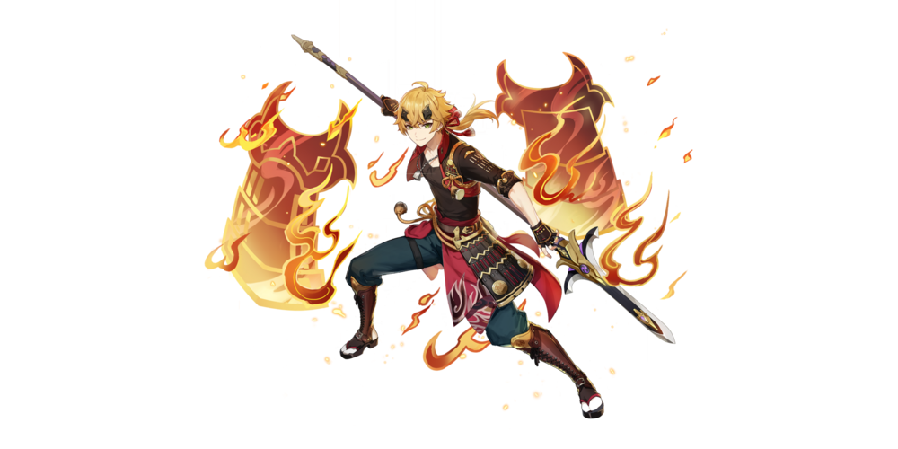

# Thoma

## Resources
* [6 Minute Guide to Thoma](https://youtu.be/hWj-Ps6QzwE)

##  Thoma

## **Base Stats**

| Lv | Base HP | Base ATK | Base DEF | ATK |
| :--- | :--- | :--- | :--- | :--- |
| 60 | 6806 | 133 | 495 | 12% |
| 60+ | 7266 | 142 | 528 | 12% |
| 70 | 7981 | 156 | 580 | 12% |
| 70+ | 8440 | 165 | 613 | 18% |
| 80 | 9156 | 179 | 665 | 18% |
| 80+ | 9616 | 188 | 699 | 24% |
| 90 | 10331 | 202 | 751 | 24% |

## **Attacks**



**Normal Attacks**  
Performs up to four consecutive spear strikes.

| String | Talent 9% | Frames | MV/s |
| :--- | :--- | :--- | :--- |
| 1-Hit DMG | 81.56% | 11 | 444.87% |
| 2-Hit DMG | 80.15% | 49 | 198% |
| 3-Hit DMG | 49.22% ×2 | \(76+89\) | 175.38% |
| 4-Hit DMG | 123.75% | 114 | 202.05% |
| Recovery | - | 155 | -- |

**Charged Attacks**  
Consumes a certain amount of Stamina to lunge forward, dealing damage to opponents along the way.

| String | Talent 9% | Frames | MV/s |
| :--- | :--- | :--- | :--- |
| Charged Attack DMG | 207.14% | \(14+56\) | -- |

* Stamina Cost:  25

**Plunge Attacks**  
Plunges from mid-air to strike the ground below, damaging opponents along the path and dealing AoE DMG upon impact.

| String | Talent 9% |
| :--- | :--- |
| Plunge DMG | 117.46% |
| Low Plunge DMG | 234.86% |
| High Plunge DMG | 293.36% |



Thoma vaults forward with his polearm and delivers a flame-filled flying kick that deals AoE Pyro DMG, while also summoning a defensive **Blazing Barrier**.
At the moment of casting, Thoma's Elemental Skill applies Pyro to himself.  
The DMG Absorption of the **Blazing Barrier** scales off Thoma's Max HP.  

The Blazing Barrier has the following traits:  
• Absorbs Pyro DMG 250% more effectively.  
• When a new **Blazing Barrier** is obtained, the remaining DMG Absorption of an existing **Blazing Barrier** will stack and its duration will be refreshed.

The maximum DMG Absorption of the **Blazing Barrier** will not exceed a certain percentage of Thoma's Max HP.

| Attribute | Skill |
| :--- | :--- |
| Skill DMG \(T9%\) | 248.88% |
| Particles | 3~4 \(3:2\) |
| Frames | 44 | 
| GU | 1A | 
| ICD | - |
| Snapshot | - | 
| Damage Element | Pyro |
| Damage Type | Skill |
| CD | 15s |

| Attribute | Shield |
| :--- | :--- |
| Shield DMG Absorption \(T9%\) | 12.24% Max HP + 1410 |
| Max Shield DMG Absorption \(T9%\) | 33.32% Max HP + 3838 |
| Shield Element | Pyro | 
| Shield Duration | 8 s |
| CD | 15s |

**Notes**
* Thoma's E refreshing the shield for Burst does not make it lose Shield Strength. 
* Losing the shield will reset its stacks.




Thoma spins his polearm, slicing at his foes with roaring flames that deal AoE Pyro DMG and weave themselves into a **Scorching Ooyoroi**.

**Scorching Ooyoroi**  
While **Scorching Ooyoroi** is in effect, the active character's Normal Attacks will trigger **Fiery Collapse**, dealing AoE Pyro DMG and summoning a **Blazing Barrier**.  
**Fiery Collapse** can be triggered once every 1s.  

Except for the amount of DMG they can absorb, the **Blazing Barriers** created in this way are identical to those created by Thoma's Elemental Skill, **Blazing Blessing**:  
• Absorbs Pyro DMG 250% more effectively.  
• When a new **Blazing Barrier** is obtained, the remaining DMG Absorption of an existing **Blazing Barrier** will stack and its duration will be refreshed.

The maximum DMG Absorption of the **Blazing Barrier** will not exceed a certain percentage of Thoma's Max HP.  
If Thoma falls, the effects of Scorching Ooyoroi will be cleared.

| Attribute | Skill | Fiery Collapse |
| :--- | :--- | :--- |
| Skill DMG \(T9%\) | 149.6% | 98.6% |
| Frames | 56 | - |
| GU | 2B | 1A |
| ICD | 3 hits / 2.5s | 3 hits / 2.5s |
| Snapshot | Dynamic | Dynamic |
| Damage Element | Pyro | Pyro |
| Damage Type | Burst | Burst |
| Energy Cost | 80 | - | 
| Duration | - | 15s |
| CD | 20s | - | 

| Attribute | Scorching Ooyoroi |
| :--- | :--- |
| Shield DMG Absorption \(T9%\) | 1.94% Max HP + 224 |
| Shield Duration | 8 s |
| Scorching Ooyoroi Duration | 15 s |
| CD | 20 s |

**Notes**
* The initial hit of **Crimson Ooyoroi** and **Fiery Collapse** damage has separate ICDs.
* The **Blazing Barrier** from Crimson Ooyoroi will stack with an existing shield created by **Blazing Blessing**, retaining the HP from the previous **Blazing Barrier**.



## **Ascension Passives**



### **Snap and Swing**

When you **fish** successfully in Inazuma, Thoma's help grants a 20% chance of scoring a double catch.



### **Imbricated Armor**

When your current active character obtains or refreshes a **Blazing Barrier**, this character's Shield Strength will increase by 5% for 6s.
This effect can be triggered once every 0.3s seconds. Max 5 stacks.

* Thoma's Shield Strength gain from **Imbricated Armor** doesn't persist on swap.
* **Blazing Barrier**s obtained from both Thoma's Elemental Skill and Elemental Burst counts towards **Imbricated Armor's** condition to stack Shield Strength. 



### **Flaming Assault**

DMG dealt by **Crimson Ooyoroi**'s **Fiery Collapse** is increased by 2.2% of Thoma's Max HP.



## **Constellations**



### **A Comrade's Duty**

When a character protected by Thoma's own **Blazing Barrier** (Thoma excluded) is attacked, Thoma's own **Blazing Blessing** CD is decreased by 3s, while his own **Crimson Ooyoroi**'s CD is decreased by 3s.
This effect can be triggered once every 20s.




### **A Subordinate's Skills**

**Crimson Ooyoroi**'s duration is increased by 3s.




### **Fortified Resolve**

Increases the Level of **Blazing Blessing** by 3.
Maximum upgrade level is 15.




### **Long-Term Planning**

After using **Crimson Ooyoroi**, 15 Energy will be restored to Thoma.




### **Raging Wildfire**

Increases the Level of **Crimson Ooyoroi** by 3.
Maximum upgrade level is 15.




### **Burning Heart**

When a **Blazing Barrier** is obtained or refreshed, the DMG dealt by all party members' Normal, Charged, and Plunging Attacks is increased by 15% for 6s.

* Every time Thoma's shield gets refreshed during Burst, the timer on  **Burning Heart**'s buff is refreshed.




## **Full Talent Values**



### Normal Attacks

|  | Lv1 | Lv2 | Lv3 | Lv4 | Lv5 | Lv6 | Lv7 | Lv8 | Lv9 | Lv10 | Lv11 |
| :--- | :--- | :--- | :--- | :--- | :--- | :--- | :--- | :--- | :--- | :--- | :--- |
| 1-Hit DMG | 44.39% | 48.01% | 51.62% | 56.78% | 60.40% | 64.53% | 70.20% | 75.88% | 81.56% | 87.75% | 93.95% |
| 2-Hit DMG | 43.63% | 47.18% | 50.73% | 55.80% | 59.35% | 63.41% | 68.99% | 74.57% | 80.15% | 86.24% | 92.33% |
| 3-Hit DMG (×2) | 26.79% | 28.97% | 31.15% | 34.26% | 36.45% | 38.94% | 42.36% | 45.79% | 49.22% | 52.96% | 56.69% |
| 4-Hit DMG | 67.36% | 72.84% | 78.32% | 86.15% | 91.63% | 97.90% | 106.52% | 115.13% | 123.75% | 133.14% | 142.54% |

### Charged Attack

|  | Lv1 | Lv2 | Lv3 | Lv4 | Lv5 | Lv6 | Lv7 | Lv8 | Lv9 | Lv10 | Lv11 |
| :--- | :--- | :--- | :--- | :--- | :--- | :--- | :--- | :--- | :--- | :--- | :--- |
| Charged Attack DMG | 112.75% | 121.92% | 131.10% | 144.21% | 153.39% | 163.87% | 178.30% | 192.72% | 207.14% | 222.87% | 238.60% |

**Stamina Cost**: 25

### Plunge

|  | Lv1 | Lv2 | Lv3 | Lv4 | Lv5 | Lv6 | Lv7 | Lv8 | Lv9 | Lv10 | Lv11 |
| :--- | :--- | :--- | :--- | :--- | :--- | :--- | :--- | :--- | :--- | :--- | :--- |
| Plunge DMG | 63.93% | 69.14% | 74.34% | 81.77% | 86.98% | 92.93% | 101.10% | 109.28% | 117.46% | 126.38% | 135.30% |
| Low Plunge DMG | 127.84% | 138.24% | 148.65% | 163.51% | 173.92% | 185.81% | 202.16% | 218.51% | 234.86% | 252.70% | 270.54% |
| High Plunge DMG | 159.68% | 172.67% | 185.67% | 204.24% | 217.23% | 232.09% | 252.51% | 272.93% | 293.36% | 315.64% | 337.92% |





|  | Lv1 | Lv2 | Lv3 | Lv4 | Lv5 | Lv6 | Lv7 | Lv8 | Lv9 | Lv10 | Lv11 | Lv12 | Lv13 |
| :--- | :--- | :--- | :--- | :--- | :--- | :--- | :--- | :--- | :--- | :--- | :--- | :--- | :--- |
| Skill DMG | 146.40% | 157.38% | 168.36% | 183.00% | 193.98% | 204.96% | 219.60% | 234.24% | 248.88% | 263.52% | 278.16% | 292.80% | 311.10% |
| Shield DMG Absorption | 7.20% Max HP+693 | 7.74% Max HP+763 | 8.28% Max HP+838 | 9.00% Max HP+919 | 9.54% Max HP+1005 | 10.08% Max HP+1098 | 10.80% Max HP+1196 | 11.52% Max HP+1300 | 12.24% Max HP+1410 | 12.96% Max HP+1525 | 13.68% Max HP+1647 | 14.40% Max HP+1774 | 15.30% Max HP+1907 |
| Max Shield DMG Absorption | 19.60% Max HP+1887 | 21.07% Max HP+2076 | 22.54% Max HP+2281 | 24.50% Max HP+2501 | 25.97% Max HP+2737 | 27.44% Max HP+2989 | 29.40% Max HP+3256 | 31.36% Max HP+3539 | 33.32% Max HP+3838 | 35.28% Max HP+4153 | 37.24% Max HP+4483 | 39.20% Max HP+4829 | 41.65% Max HP+5191 |

**Shield Duration**: 8s  
**Cooldown**: 15s





|  | Lv1 | Lv2 | Lv3 | Lv4 | Lv5 | Lv6 | Lv7 | Lv8 | Lv9 | Lv10 | Lv11 | Lv12 | Lv13 |
| :--- | :--- | :--- | :--- | :--- | :--- | :--- | :--- | :--- | :--- | :--- | :--- | :--- | :--- |
| Skill DMG | 88.0% | 94.6% | 101.2% | 110.0% | 116.6% | 123.2% | 132.0% | 140.8% | 149.6% | 158.4% | 167.2% | 176.0% | 187.0% |
| Fiery Collapse DMG | 58.00% | 62.35% | 66.70% | 72.50% | 76.85% | 81.20% | 87.00% | 92.80% | 98.60% | 104.40% | 110.20% | 116.00% | 123.25% |
| Shield DMG Absorption | 1.14% Max HP+110 | 1.23% Max HP+121 | 1.32% Max HP+133 | 1.43% Max HP+146 | 1.52% Max HP+160 | 1.60% Max HP+174 | 1.72% Max HP+190 | 1.83% Max HP+206 | 1.94% Max HP+224 | 2.06% Max HP+242 | 2.17% Max HP+261 | 2.29% Max HP+282 | 2.43% Max HP+303 |

**Shield Duration**: 8s  
**Scorching Ooyoroi Duration**: 15s  
**Cooldown**: 20s  
**Energy Cost**: 80




## Evidence Vault


