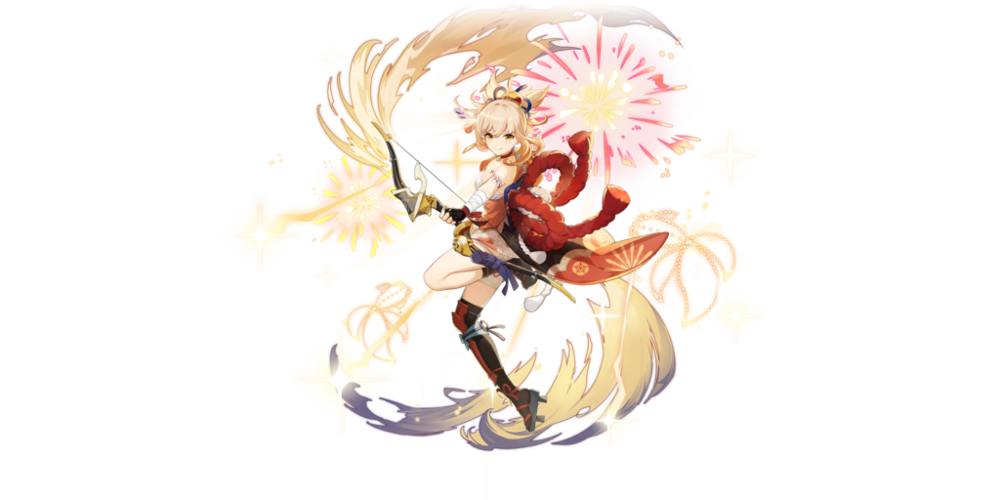

# Yoimiya

## **Resources**
* [6 Minute Yoimiya Quick Guide](https://www.youtube.com/watch?v=FjDsbxPbk50)
* [Yoimiya Full Guide](https://keqingmains.com/yanfei/)

##  Yoimiya

## **Base Stats**

| Lv | Base HP | Base ATK | Base DEF | CRIT Rate |
| :--- | :--- | :--- | :--- | :--- |
| 60 | 6593 | 209 | 399 | 14.6% |
| 60+ | 7075 | 225 | 428 | 14.6% |
| 70 | 7777 | 247 | 470 | 14.6% |
| 70+ | 8259 | 262 | 500 | 19.4% |
| 80 | 8968 | 285 | 542 | 19.4% |
| 80+ | 9450 | 300 | 572 | 24.2% |
| 90 | 10164 | 323 | 615 | 24.2% |

## **Attacks**



**Normal Attacks**  
Performs up to 5 consecutive shots with a bow.

| String | Talent 6% | Frames | MV/s |
| :--- | :--- | :--- | :--- |
| 1-Hit DMG | 49.01% ×2 (98.02%) | 18 + 27 | 217.82%/s |
| 2-Hit DMG | 94.02% | 51 | 225.93%/s |
| 3-Hit DMG | 122.22% | 88 | 214.27%/s |
| 4-Hit DMG | 63.83%×2 | 113 + 128 | 207.15%/s |
| 5-Hit DMG | 145.56% | 164 | 214.93%/s |
| With Recovery | -- | 200 | 176.24%/s |

* The auto-aim range for her normals is around 6 abyss tiles (~15.3 meters)

**Aimed Shot**  
Performs a more precise Aimed Shot with increased DMG. While aiming, flames will accumulate on the arrowhead before being fired off as an attack.  

* Charge Level 1: Fires off a flaming arrow that deals Pyro DMG. 
* Charge Level 2: Generates a maximum of 3 **Kindling Arrows** based on time spent charging, releasing them as part of this Aimed Shot. Kindling Arrows will home in on nearby opponents, dealing Pyro DMG on hit.

| String | Talent 6% | GUs | Frames | MV/s |
| :--- | :--- | :--- | :--- | :--- |
| Aimed Shot | 63.75% | -- | -- | -- |
| Fully-Charged Aimed Shot | 173.6% | 1A | -- | -- |
| Kindling Arrow DMG | 22.96% | 1A | -- | -- |

* **Kindling Arrows** last around 2.5 seconds, don't drop off like regular arrows, and have auto lock aiming at a semi wide range.
* Yoimiya can have all three **Kindling Arrows** up after **Niwabi Fire Dance** ends, so long as the required charging time is met.
* **Kindling Arrows** are affected by Amos' Bow's passive and reach max stacks at low range.

**Plunge Attacks**  
Fires off a shower of arrows in mid-air before falling and striking the ground, dealing AoE DMG upon impact.

| String | Talent 6% |
| :--- | :--- |
| Plunge DMG | 82.6% |
| Low/High Plunge DMG | 165.17% / 206.3% |




Yoimiya waves a sparkler and causes a ring of saltpeter to surround her. 

**Niwabi Enshou**  
During this time, arrows fired by Yoimiya's Normal Attack will be **Blazing Arrows**, and their DMG will be increased and converted to Pyro DMG. During this time, Normal Attack: Firework Flare-Up will not generate Kindling Arrows at Charge Level 2. This effect will deactivate when Yoimiya leaves the field.

| Attribute | Skill | 
| :--- | :--- |
| Blazing Arrow DMG \(T6%\) | 149.94% Normal Attack DMG |
| Particles | 1 (-) per proc |
| Frames | 23 |
| GU | 1A |
| ICD | 3 hit / 2.5s |
| Damage Element | Pyro |
| Damage Type | Normal Attack |
| Duration | 10s |
| CD | 18s |

**Notes**
* The Damage Bonus from **Niwabi Fire-Dance** is multiplicative.
* Yoimiya's particle generation triggers on infused arrow hit and has an ICD of 2s on particle generation.
  * Yoimiya's particle generation procs cannot be buffered, so Yoimiya will ideally generate 4 particles over the duration of **Niwabi Fire-Dance**
* Charged Shots during the duration of **Niwabi Fire-Dance** do not generate particles.
* Yoimiya can still produce energy even after **Niwabi Fire-Dance** expires as long as the ICD is off CD and the infused normal attack string arrow lands.

**Interactions**
* Yoimiya's **Niwabi Fire-Dance's Blazing Arrow** DMG increase does not increase Yun Jin's **Cliffbreaker's Banner** bonus.



Yoimiya leaps into the air along with her original creation, the "**Ryuukin Saxifrage**," and fires forth blazing rockets bursting with surprises that deal AoE Pyro DMG and mark one of the hit opponents with **Aurous Blaze**.

**Aurous Blaze**  
All Normal/Charged/Plunging Attacks, Elemental Skills, and Elemental Bursts by any party member other than Yoimiya that hit an opponent marked by **Aurous Blaze** will trigger an explosion, dealing AoE Pyro DMG. When an opponent affected by **Aurous Blaze** is defeated before its duration expires, the effect will pass on to another nearby opponent, who will inherit the remaining duration. One **Aurous Blaze** explosion can be triggered every 2s. When Yoimiya is down, **Aurous Blaze** effects created through her skills will be deactivated.

| Attribute | Burst | Aurous Blaze Explosion |
| :--- | :--- | ---- |
| Skill DMG (T6%) | 178.08% | 170.8% |
| Frames | 115 | - |
| GU | 2B | 1A |
| ICD | None | 3 hit / 2.5s |
| Snapshot? | Dynamic | Dynamic |
| DMG Element | Pyro | Pyro |
| DMG Type | Burst | Burst |
| Energy Cost | 60 | - |
| CD | 15s | - |
| Duration | 10s | - |




## **Ascension Passives**



### **Blazing Match**

When Yoimiya crafts Decoration, Ornament, and Landscape-type Furnishings, she has a 100% chance to refund a portion of the materials used.



### **Tricks of the Trouble-Maker**

During Niwabi Fire-Dance, shots from Yoimiya's Normal Attack will increase her Pyro DMG Bonus by 2% on hit. This effect lasts for 3s and can have a maximum of 10 stacks.

* Stacks gained from **Tricks of the Trouble-Maker** do not have independent durations, each Normal Attack hit will refresh the duration of all stacks to 3s.
* The Pyro DMG Bonus from **Tricks of the Trouble-Maker** can last up to 3s after **Niwabi Fire-Dance** ends.
* Gaining stacks will cause the orbitting sparks from **Niwabi Fire-Dance** to increase in brightness.




### **Summer Night's Dawn**

Using Ryuukin Saxifrage causes nearby party members (not including Yoimiya) to gain a 10% ATK increase for 15s. Additionally, a further ATK Bonus will be added on based on the number of "Tricks of the Trouble-Maker" stacks Yoimiya possesses when using Ryuukin Saxifrage. Each stack increases this ATK Bonus by 1%.



## **Constellations**



### **Agate Ryuukin**

The Aurous Blaze created by Ryuukin Saxifrage lasts for an extra 4s. Additionally, when an opponent affected by Aurous Blaze is defeated within its duration, Yoimiya's ATK is increased by 20% for 20s.



### **A Procession of Bonfires**

When Yoimiya's Pyro DMG scores a CRIT Hit, Yoimiya will gain a 25% Pyro DMG Bonus for 6s. This effect can be triggered even when Yoimiya is not the active character.



### **Trickster's Flare**

Increases the Level of Niwabi Fire-Dance by 3. Maximum upgrade level is 15.



### **Pyrotechnic Professional**

When Yoimiya's own Aurous Blaze triggers an explosion, Niwabi Fire-Dance's CD is decreased by 1.2s.



### **A Summer Festival's Eve**

Increases the Level of Ryuukin Saxifrage by 3. Maximum upgrade level is 15.



### **Naganohara Meteor Swarm**

During Niwabi Fire-Dance, Yoimiya's Normal Attacks have a 50% chance of firing an extra Kindling Arrow that deals 60% of its original DMG. This DMG is considered Normal Attack DMG.

 * Kindling Arrow shares ICD with Yoimiya's infused normal attacks.




## **Full Talent Values**



### Normal Attacks

|  | Lv6 | Lv7 | Lv8 | Lv9 | Lv10 | Lv11 |
| :--- | :--- | :--- | :--- | :--- | :--- | :--- |
| 1-Hit DMG (x2) | 49.01% | 52.65% | 56.29% | 59.94% | 63.59% | 67.23% |
| 2-Hit DMG | 94.02% | 101.01% | 108% | 115% | 121.99% | 128.98% |
| 3-Hit DMG | 122.22% | 131.31% | 140.4% | 149.49% | 158.59% | 167.68% |
| 4-Hit DMG (x3) | 63.83% | 68.58% | 73.32% | 78.07% | 82.82% | 87.57% |
| 5-Hit DMG | 145.56% | 156.39% | 167.22% | 178.04% | 188.87% | 199.7% |

### Charged Attack

|  | Lv6 | Lv7 | Lv8 | Lv9 | Lv10 | Lv11 |
| :--- | :--- | :--- | :--- | :--- | :--- | :--- |
| Aimed Shot | 63.75% | 69.36% | 74.97% | 80.58% | 86.7% | 92.82% |
| Fully-Charged Aimed Shot | 173.6% | 186% | 198.4% | 210.8% | 223.2% | 235.6% |
| Kindling Arrow DMG | 22.96% | 24.6% | 26.24% | 27.88% | 29.52% | 31.16% |

### Plunge

|  | Lv6 | Lv7 | Lv8 | Lv9 | Lv10 | Lv11 |
| :--- | :--- | :--- | :--- | :--- | :--- | :--- |
| Plunge DMG | 82.6% | 89.87% | 97.14% | 104.41% | 112.34% | 120.27% |
| Low Plunge DMG | 165.17% | 179.7% | 194.23% | 208.77% | 224.62% | 240.48% |
| High Plunge DMG | 206.3% | 224.45% | 242.61% | 260.76% | 280.57% | 300.37% |



|  | Lv6 | Lv7 | Lv8 | Lv9 | Lv10 | Lv11 | Lv12 | Lv13 |
| :--- | :--- | :--- | :--- | :--- | :--- | :--- | :--- | :--- |
| Blazing Arrow DMG | 149.94% Normal Attack DMG | 152.89% Normal Attack DMG | 155.84% Normal Attack DMG | 158.79% Normal Attack DMG | 161.74% Normal Attack DMG | 164.7% Normal Attack DMG | 167.65% Normal Attack DMG | 170.6% Normal Attack DMG |

**Duration:** 10s  
**Cooldown:** 18s



|  | Lv6 | Lv7 | Lv8 | Lv9 | Lv10 | Lv11 | Lv12 | Lv13 |
| :--- | :--- | :--- | :--- | :--- | :--- | :--- | :--- | :--- |
| Skill DMG | 178.08 | 190.8 | 203.52 | 216.24 | 228.96 | 241.68 | 254.4 | 270.3 |
| Aurous Blaze Explosion DMG | 170.8 | 183 | 195.2 | 207.4 | 219.6 | 231.8 | 244 | 259.25 |

**Energy Cost**: 60  
**Duration**: 10s  
**Cooldown**: 15s



## Evidence Vault


