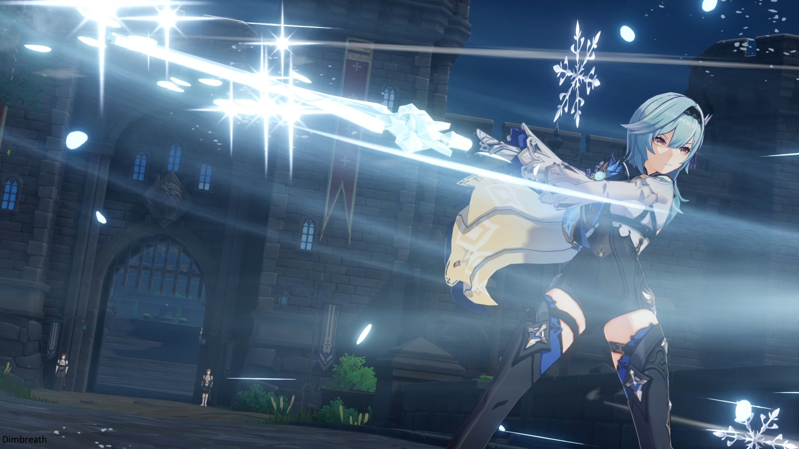

# Eula


Leaked character from CBT5, all numbers subject to change and data poisoning. Credit to Honey and Dimbreath.


##  Eula

## **Base Stats**

| Lv | Base HP | Base ATK | Base DEF | CRIT DMG% |
| :--- | :--- | :--- | :--- | :--- |
| 60 | 8579 | 222 | 487 | 69.20% |
| 60+ | 9207 | 238 | 523 | 69.20% |
| 70 | 10119 | 262 | 574 | 69.20% |
| 70+ | 10746 | 278 | 610 | 78.80% |
| 80 | 11669 | 302 | 662 | 78.80% |
| 80+ | 12296 | 318 | 698 | 88.40% |
| 90 | 13226 | 342 | 751 | 88.40% |

## **Attacks**



**Normal Attack**  

| String | Talent 6% | Frames | MV/s |
| :--- | :--- | :--- | :--- |
| 1-Hit | 109.63% |  |  |
| 2-Hit | 117.50% |  |  |
| 3-Hit | 66.56% x2 |  |  |
| 4-Hit |	156.75% |  |  |
| 5-Hit | 86.06% x2 |  |  |

**Charged Attack**  

| Type | Talent 6% | Frames | MV/s |
| :--- | :--- | :--- | :--- |
| Spinning DMG | 	100% |  |  |
| Final DMG | 180.81%	 |  |  |
| Stamina Cost | 40/s |  |  |

**Plunge Attack**  

| Type | Talent 6% |
| :--- | :--- |
| Plunge DMG | 108.41% |
| Low Plunge DMG | 216.78% |
| High Plunge DMG | 270.77% |





| Effect | Talent 6% |
| :--- | :--- |
| Press DMG | 204.96% |
| Hold DMG | 343.84% |
| Icewhirl Brand DMG | 134.40% |
| DEF Bonus | 30% per stack |
| Phys + Cryo RES Decrease | 21% |
| RES Decrease Duration | 7s per stack |
| Grimheart Duration | 18s |
| Press CD | 4s |
| Hold CD | 10s |
| Particles |  |
| GU |  |
| Frames |  |
| MV/s |  |





| Effect | Talent 6% |
| :--- | :--- |
| Skill DMG | 287.84% |
| Lightfall Sword Base DMG | 512.50% |
| DMG per Stack | 93.75% |
| Maximum Stacks | 30 |
| CD | 20s |
| Energy Cost | 80 |
| GU |  |
| Frames |  |
| MV/s |  |




## **Ascension Passives**















## Constellations



























## **Full Talent Values**



### Normal Attacks

|  | Lv6 | Lv7 | Lv8 | Lv9 | Lv10 | Lv11 |
| :--- | :--- | :--- | :--- | :--- | :--- | :--- |
| 1-Hit DMG | 109.63% | 119.27% | 128.92% | 138.57% | 149.09% | 161.15% |
| 2-Hit DMG | 117.50% | 127.84% | 138.18% | 148.52% | 159.80% | 172.73% |
| 3-Hit DMG | 66.56% + 66.56% | 72.42% + 72.42% | 78.28% + 78.28% | 84.14% + 84.14% | 90.53% + 90.53% | 97.85% + 97.85% |
| 4-Hit DMG | 156.75% | 170.54% | 184.34% | 198.13% | 213.18% | 230.42% |
| 5-Hit DMG | 86.06% + 86.06% | 93.64% + 93.64% | 101.21% + 101.21% | 108.78% + 108.78% | 117.05% + 117.05% | 126.51% + 126.51% |

### Charged Attack

|  | Lv6 | Lv7 | Lv8 | Lv9 | Lv10 | Lv11 |
| :--- | :--- | :--- | :--- | :--- | :--- | :--- |
| Charged Attack Spinning DMG | 100% | 108.80% | 117.60% | 126.40% | 136% | 147% |
| Charged Attack Final DMG | 180.81% | 196.72% | 212.64% | 228.55% | 245.91% | 265.79% |

**Stamina Cost**: 40

**Maximum Duration**: 5s

### Plunge

|  | Lv6 | Lv7 | Lv8 | Lv9 | Lv10 | Lv11 |
| :--- | :--- | :--- | :--- | :--- | :--- | :--- |
| Plunge Impact | 108.41% | 117.95% | 127.49% | 137.03% | 147.44% | 159.37% |
| Low Plunge DMG | 216.78% | 235.86% | 254.93% | 274.01% | 294.82% | 318.67% |
| High Plunge DMG | 270.77% | 294.6% | 318.42% | 342.25% | 368.25% | 398.03% |



|  | Lv6 | Lv7 | Lv8 | Lv9 | Lv10 | Lv11 | Lv12 | Lv13 |
| :--- | :--- | :--- | :--- | :--- | :--- | :--- | :--- | :--- |
| Press DMG | 204.96% | 219.60% | 234.24% | 248.88% | 263.52% | 278.16% | 292.80% | 311.10% |
| Hold DMG | 343.84% | 368.40% | 392.96% | 417.52% | 442.08% | 466.64% | 491.20% | 521.90% |
| Icewhirl Brand DMG | 134.40% | 144% | 153.60% | 163.20% | 172.80% | 182.40% | 192% | 204% |
| Phys + Cryo RES Decrease | 21% | 22% | 23% | 24% | 25% | 25% | 25% | 25% |

**DEF Bonus**: 30% per stack

**RES Decrease Duration**: 7s per stack

**Grimheart Duration**: 18s

**Press Cooldown**: 4s

**Hold Cooldown**: 10s



|  | Lv6 | Lv7 | Lv8 | Lv9 | Lv10 | Lv11 | Lv12 | Lv13 |
| :--- | :--- | :--- | :--- | :--- | :--- | :--- | :--- | :--- |
| Skill DMG | 287.84% | 308.40% | 328.96% | 349.52% | 370.08% | 390.64% | 411.20% | 436.90% |
| Lightfall Sword Base DMG | 512.50% | 557.60% | 602.70% | 647.80% | 697% | 753.38% | 819.67% | 885.97% |
| DMG Per Stack | 93.75% | 102% | 110.25% | 118.50% | 127.50% | 137.81% | 149.94% | 162.07% |

**Energy Cost**: 80

**Maximum Stacks**: 30

**Cooldown**: 20s



## **External Links**

* [Honey Hunters](https://genshin.honeyhunterworld.com/db/char/eula/)
