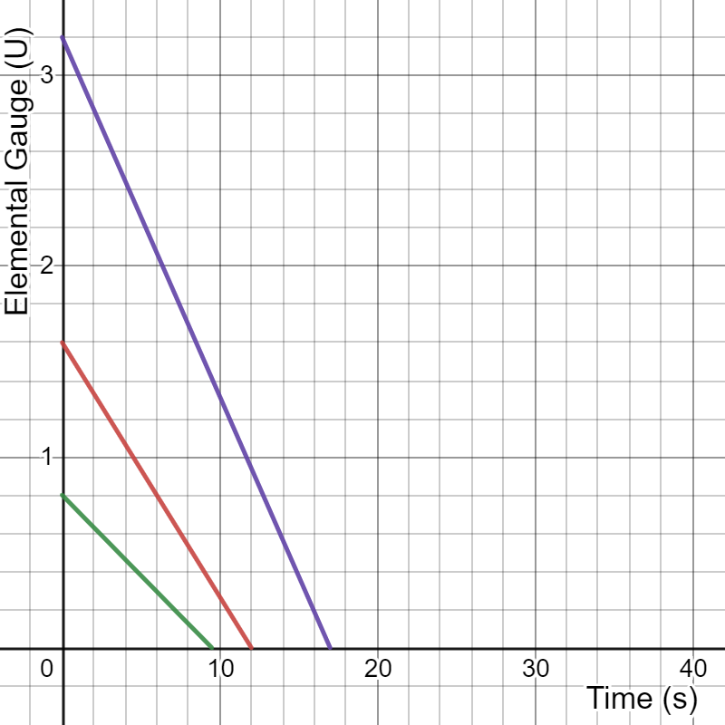
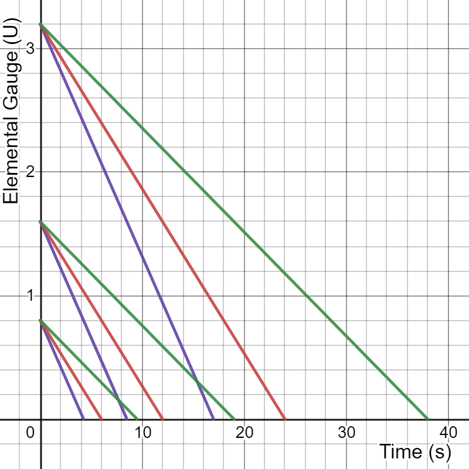

# Elemental Gauge Theory

## Disclaimer

To our knowledge, the framework of Elemental Gauge Theory can be applied to explain any elemental-related concept in Genshin. Extensive testing has been done and is viewable in the Evidence Vault under [Gauge Unit Theory - Testing and Evidence](../../evidence/combat-mechanics/elemental-effects/elemental-gauge-theory.md#gauge-unit-theory-testing-and-evidence).


If any words are unfamiliar, we have a entry on [common terms](../../theorycrafting.md#reaction-terms), with a specific section on terms commonly found when discussing reactions.


## Notation

When an elemental source is used to apply an element, it applies a number of elemental **units** onto the enemy. The respective character page should be referenced to see how many U each source applies. However, this alone is not enough. It must also be combined with the **unit modifier** specific to the situation.

Units \(U\) are reported as the type of aura they apply, but elemental applications have to account for both decay rate and reactions so the notation for Elemental Gauge Theory has been appended to reflect that.

When extending auras with stronger attacks with higher U or consuming auras via elemental reactions, **the resulting auras are not simply an addition of the unit U**. Therefore, Gauge Units \(GU\) and the decay rate have to be separated from each other to make good general use of the theory.

Gauge Units are used to calculate the remaining aura for elemental reactions. The decay rate of the remaining aura will be the first applied aura and should be written as stated below.

The decay notation number indicates the original system of elemental units that are applied \(1U, 2U, or 4U\), while the letter notation \(A, B, or C\) notes the decay rate of the aura.

| Original Notation | Reaction Notation | Decay Notation | Decay Rate Conversion |
| :--- | :--- | :--- | :--- |
| 1U | 1GU | 1A | 11.875s per A |
| 2U | 2GU | 2B | 7.5s per B |
| 4U | 4GU | 4C | 5.3125s per C |

## Aura Application

Aura application has a 0.8x modifier. This is also referred to as **Aura Tax**.

| Elemental Gauge of Source | After Unit Modifier |
| :--- | :--- |
| 1GU | 0.8GU |
| 2GU | 1.6GU |
| 4GU | 3.2GU |

**Example of Aura Application:**

> Kaeya’s E applies 2B * 0.8 = 1.6B Cryo aura and the decay rate is 7.5s per B.

In addition, neither Anemo nor Geo may be applied as an aura.  
Hereinafter, all aura applications will be referred to with this unit modifier already applied.

## Character Elemental Gauge Application

Each character has a set amount of elemental gauge applied by each individual attack or skill. A full list of character skills and their corresponding elemental gauges can be found below:  


## Decay Rate

Decay rate is determined by the **first aura** applied. This decay rate is always in effect, until the aura is fully consumed/decayed.

* **Y-Axis** = amount of elemental gauge
* **X-Axis** = duration in seconds

Additional applications of the aura element will apply their own respective gauges, but follow the decay rate of the original aura. Meaning, a 2B or 4C gauge elemental sources can be decaying at the rate of an A gauge. To do this, apply a 1A gauge, then apply a 2B or 4C gauge of the same element to get 1.6A or 3.2A auras.

> Fischl's Charged Shot applies 0.8A Electro, the use of Beidou's Q will add 3.2C Electro to the gauge, resulting in a 3.2A Electro aura persisting for 38 seconds from the time of Beidou Q.

* **Y-axis** = amount of elemental gauge
* **X-axis** = duration in seconds
* **Purple** = C decay rate
* **Red** = B decay rate
* **Green** = A decay rate

Also see a much better graph by Kourinn\#6001 [Google Sheet](https://docs.google.com/spreadsheets/d/1VDOg9eRh7075T5x1kK5tKtiB9E6eFcA07USqPXfc2lo/edit#gid=601754041)

Something to note is that without extending auras, the total duration of an aura applied to the enemy is equivalent to 2.5 times the gauge of the elemental source in GU plus 7 seconds. This alongside the post-tax gauge may be used to calculate the decay rate. The letter notation makes it easier to refer to a few standard decay rates.

## Overload and Superconduct

These transformative reactions have a 1x modifier (effectively no modifier).

When an elemental trigger is applied, it subtracts the corresponding number of elemental units from the enemy’s existing gauge.

> Kaeya’s E applies 1.6B Cryo aura and is triggered by Fischl’s charged shot, which applies 1A Electro. Superconduct occurs, 0.6B Cryo aura remains.

If the Trigger Gauge is greater than the Aura Gauge, a reaction will still occur and the aura will be fully consumed and no element will be left behind because **gauges cannot go below zero**.

> Fischl’s charged shot applies 0.8A Electro aura and is triggered by Kaeya’s E, applying 2B Cryo. Superconduct occurs, and no aura is left behind as triggers can only remove units, they can’t add aura/gauge.

The AOE of these reactions have zero elemental gauge.

## Freeze

Once freeze is triggered, an enemy will be afflicted by a **frozen aura**. Reactions with frozen are equivalent to those with cryo, though the gauge of a frozen aura is often significantly higher. In addition, cryo and hydro may exist alongside the frozen aura. Removing the frozen aura, either through melt or shatter, will also remove frozen and expose the **coexisting** cryo/hydro aura, allowing any elemental sources to react with cryo/hydro. Even while the cryo/hydro aura is hidden under the frozen aura, it will continue to decay as normal.

Freeze is extended when the cryo or hydro is applied to freeze with a coexisting hydro or cryo aura respectively.

More details on the frozen aura, including duration, coexisting cryo/hydro, and extension may be found in the advanced guide.

## Melt and Vaporize

### Reaction Basics

* Melt and Vaporize have weak and strong elements
* Using a weak element as the trigger results in a 1.5x dmg multiplier. This is referred to as a **reverse** vape/melt

  > Cryo triggering Melt and Pyro triggering Vaporize

* Using a strong element as the trigger results in a 2.0x dmg multiplier. This is referred to as a **forward** vape/melt

  > Pyro triggering Melt and Hydro triggering Vaporize

### **Unit Modifiers to Gauge Consumption**

Weak amping elemental triggers have a 0.5x modifier.

| Elemental Gauge of Source | After Unit Modifier |
| :--- | :--- |
| 1GU | 0.5GU |
| 2GU | 1GU |

> An enemy affected by Amber’s Charged Shot has 1.6B Pyro. Using Kaeya’s E \(2B Cryo\) only removes 1GU Pyro because weak melt occurs when the trigger is Cryo.

Strong amping elemental triggers have a 2x modifier.

| Elemental Gauge of Source | After Unit Modifier |
| :--- | :--- |
| 1GU | 2GU |
| 2GU | 4GU |

> An enemy affected by Kaeya’s E has 1.6B Cryo. Using Diluc’s E \(1A\) removes 2GU worth of Cyro aura because strong melt occurs when the trigger is Pyro. This leaves us with 0GU Cryo as gauges cannot go below zero.

## Crystallize and Swirl

Geo and Anemo can only be used as the trigger for crystallize and swirl reactions respectively. All Geo/Anemo triggers have a 0.5x modifier. Because Geo and Anemo cannot be applied as auras, they do not have an associated decay rate, so Geo and Anemo sources will only be refered to in GU.

| Elemental Gauge of Source | After Unit Modifier |
| :--- | :--- |
| 1GU | 0.5GU |
| 2GU | 1GU |
| 4GU | 2GU |

> Using a 1GU Geo trigger on a 0.8A Electro aura will result in Crystallize, subtracting 0.5GU and leaving 0.3A of Electro aura.

Unlike other transformative reactions which have an AOE, the AOE of swirl has a non-zero gauge, which shall be explored in the following
section.

## Swirl Application

Swirl application occurs when an elemental source is applied to an enemy through the use of swirl spreading an element. This may trigger additional reactions and or apply an aura following the same rules as any other elemental source. Notably, tax is applied to any swirl application that becomes an aura.

The gauge amount and decay rate of the swirl application depend on both the aura of the entity on which swirl triggered as well as the gauge of the anemo trigger. The specifics are beyond the scope of this document and may be found in the advanced guide. A few basic examples may be seen in the table here:

| Elemental Gauge of Aura | Anemo Gauge | Gauge of Swirl | Aura Applied After Tax | Decay Rate Conversion |
| :--- | :--- | :--- | :--- | :--- |
| 0.8GU | 1GU | 2.2GU | 1.76GU | ~7.10227s per GU |
| 0.8GU | 2GU | 1.95GU | 1.56GU | ~7.61218s per GU |
| 1.6GU | 2GU | 3.45GU | 2.76GU | ~5.66123s per GU |

We have dropped the usage of unique letter notation to represent the decay rate of auras applied by swirl, due to their non-standard gauge (and thus decay) values.

Like all other applied auras, you can extend the duration of a swirled aura by already having an aura of the same element on an enemy.

Barbara attacks an enemy and applies 1A Hydro. Venti's E (2GU Anemo) swirls a hydro abyss mage, spreading 3.45GU Hydro to the enemy with 1A Hydro. Now, after that enemy has 2.76A hydro, which will last a maximum of 32.775s.

## Electro-Charged

Electro-charged \(EC\) is unique to all previously covered reactions. The current theory is that in EC, both Hydro and Electro simultaneously function and coexist as both the aura and trigger.

EC is triggered when an enemy with a Hydro or Electro aura has the other aura applied to it. EC will tick once per second so long as enough electro and hydro gauge remain, except in the following case:

> When either the Electro or Hydro gauge completely decays, the next EC tick will prematurely occur at the moment when the gauge is completely decayed. However, if one of the gauges empties within 0.5s of the last EC tick, there will not be another tick of EC.

Each tick of EC **consumes 0.4GU from both gauges**. Once a gauge is empty, the element will disappear from the enemy’s status, but the other element will remain available to further reactions.

AOE ticks of Electro-Charged have zero gauge.

## Self Aura

Self Auras are elements applied to the player character. This can be from sources such as: leylines, taking elemental damage from an enemy, or having an ability that imbues the character with an element.

These all have the ability to react with a slightly different ruleset from standard Gauge Theory. When a reaction is triggered and the trigger application has a higher U value than the Self Gauge, the Self Aura transitions directly to the other element.

## **Credits**

### **Writers:**

* Neptunya\#8291
* Artesians\#0002
* Aluminum\#5462
* Faranight\#0001

### Theorycrafters:

* Doug\#8888
* HailCorporate\#2970
* BowlSoldier\#3528
* Zephan\#9493
* Bobrokrot\#0111
* IonFox\#8887
* Monochrom9\#8058
* Some Proselytizer\#8340
* Aetherpon\#5730
* srl\#2712  
* sigurd\#3854
* Isu\#6867
* Kourinn\#6001

## Media

### [TenTen](https://www.youtube.com/user/tatecheng1010)



### [AoShenCraft](https://www.youtube.com/channel/UCJgiYNvX6zHP1pChMZhqURA)



## **External Links**

* [Genshin Impact Fandom](https://genshin-impact.fandom.com/wiki/Elemental_Reactions#:~:text=Transformative%20Reactions%20include%20Overloaded%2C%20Shattered,Elemental%20Mastery%20of%20the%20character)
* [Elemental Gauge Application Sheet for All Characters](https://docs.google.com/spreadsheets/d/e/2PACX-1vRB--YvbgAJFV4LVRj9Dx-UhzIfT5YbPrYkFUZiwqeBsSQAtNyY8rkRn___knQflvi7UdJKByEXxtRk/pubhtml)

## Evidence Vault



