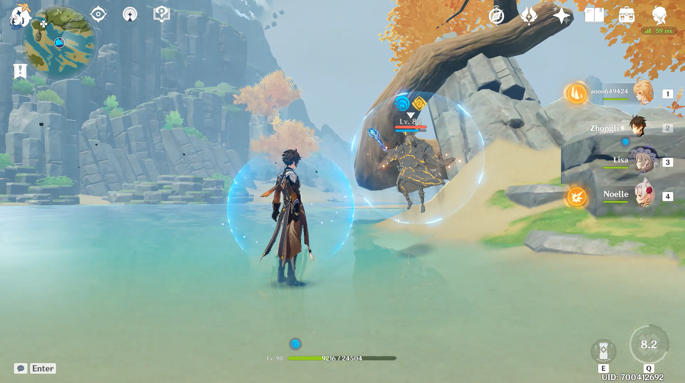
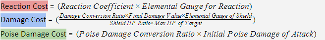

# Enemy Shields and Armor

## Introduction

Currently, there are two main types of shields that players should be aware of, **Elemental Shields** and **Elemental Armor**. We'll talk about what the differences are between these two shield types, as well as how to eliminate them. **An understanding of Gauge units and ICD is required.**



## Elemental Shields

**Elemental Shields** are shields that **NEED** to be taken down in order to deal direct damage to the enemy HP bar.

To deal with Elemental Shields, you'll need to apply a different **Elemental Aura**. For example, The fastest way to take down a **Cryo Shield** is by applying a total of **6U** **Pyro Aura**. However, **Pyro Aura** is not the only **Aura** that can take down a **Cryo Shield.**

Due to the nature of how ICD works, it is recommended to use different character rotations as opposed to spamming a certain attack, like **Infused Normals**. That being said, **Bow Users** can spam their **Charged Attack** to apply an **aura** over and over because the assumption is that the charge time is longer than the ICD.

Before we get into how to deal with different types of shields, some types \(**whether its Elemental Shield or Armor**\) can be damaged through **Heavy Attacks** and **Light Attacks**. These types of attacks **deal bonus damage** due to their property of being Heavy or Light \(and some attacks are neither Heavy nor Light\). However, Light Attacks do insignificant damage, and it's advisable to avoid using **Light Attacks** to break **Shields**.

Abyss mage shields, unlike other types of shields, take any damage directly. Any type of attack reduces Abyss mage shields HP by the amount of damage it deals **in addition** to bonus damage due to Elemental Aura application. However, Abyss mage shields have very large HP pools and it is not advisable to rely on direct damage compared to elemental damage.

To add to that, **Geo Attacks** are considered **Heavy Attacks** and also can cause **Crystallize**. Meaning the **GU** required to break **Shields** that are susceptible to both **Geo and Heavy Attacks** is much less in practice.

The following is a table consisting of different types of **Elemental Shields** as well as how many **Gauge units** are required to take them down.[Character Gauge Units Database](https://docs.google.com/spreadsheets/d/1uiJje5yqv7v2UKrWoBAgBMrHrrNemtkooo8JqAGJpP8/edit#gid=162614118)

### Abyss Order



| Elemental Source | Gauge Units Required |
| :--- | :--- |
| Pyro | Null |
| Hydro | 6GU |
| Electro | 12GU |
| Cryo | 24GU |
| Anemo | 24GU |
| Geo | 24GU |



| Elemental Source | Gauge Units Required |
| :--- | :--- |
| Cryo | Null |
| Hydro | Null |
| Pyro | 6GU |
| Electro | 12GU |
| Anemo | 24GU |
| Geo | 24GU |

**Note: Cryo Elemental Shields** are the only shields that can be damaged with Heavy attacks such as Claymore hits. It takes ~24 Claymore hits to break a **Cryo Elemental Shield.**



| Elemental Source | Gauge Units Required |
| :--- | :--- |
| Hydro | Null |
| Cryo | 12GU |
| Electro | 15GU |
| Pyro | 24GU |
| Anemo | 24GU |
| Geo | 24GU |



| Elemental Source | Gauge Units Required |
| :--- | :--- |
| Electro | Null |
| Cryo | 8GU |
| Hydro | 8GU |
| Pyro | 8GU |
| Anemo | 16GU |
| Geo | 16GU |



| Elemental Source | Gauge Units Required |
| :--- | :--- |
| Hydro | Null |
| Cryo | 36GU |
| Electro | 45GU |
| Pyro | 72GU |
| Anemo | 72GU |
| Geo | 72GU |



| Elemental Source | Gauge Units Required |
| :--- | :--- |
| Electro | Null |
| Cryo | 36GU |
| Pyro | 36GU |
| Hydro | 45GU |
| Anemo | 72GU |
| Geo | 72GU |



### Slimes



| Elemental Source | Gauge Units Required |
| :--- | :--- |
| Pyro | 4GU |
| Electro | 8GU |
| Anemo | 16GU |
| Geo | 16GU |
| Claymore N1 | 14 Hits |



| Damage Source | Hits Required |
| :--- | :--- |
| Claymore N1 | 6 |
| Ningguang N1 | 6~7 |
| Overload | 6~7 |

**Important: Geo Slimes** can lose their **Shield** through **Crystallize Reaction.** Claymore attacks vary in strength from character to other but the difference should be 1 Normal.



### Cicin Mages



Before we get into how to take down a **Cryo Cicin Mage's Elemental Shield,** first we have to know that the amount of **Cicin** \(or flies\) matter. The less **Cicin** there are, the easier it is to take down their **Shield.  
C = Numbers of Cicin alive.**

| Elemental Source | Gauge Units Required |
| :--- | :--- |
| Pyro | 2GU × C |
| Electro | 4GU × C |
| Anemo | 8GU × C |
| Geo | 8GU × C |



**Elemental Shield strength varies from domains, abyss, co-op, and overworld. Testing was done in overworld using level 1 Weapons and no Artifacts.**

## Elemental Armor

**Elemental Armor** is the type of shield that protects mobs such as **Stonehide Lawachurl, Fatui, Geo Slimes, and Regisvine bosses.**

One thing to remember is that unlike **Elemental Shields**, it is possible to deal direct damage to enemies protected by **Elemental Armor**. However, the enemy gains +100% RES to Elemental attacks and Physical attacks while armored, which comes out to a total of 110% Elemental RES and 80% Physical RES.

The **Elemental Armor** surrounding specifically **Fatui Agents** works in a unique way. Unlike other shield types, they are only damaged by the **Specific Element** that counters them. For instance, an **Electro Fatui's Elemental Armor** will only take damage if inflicted by **Cryo Element.** Other elements deal extremely insignificant damage that it is practically negligible.

The following are tables consisting of different types of **Elemental Armor** as well as how to take them down:

### Fatui



| Fatui Skirmisher Type | Element + Gauge Units |
| :--- | :--- |
| Cryo Fatui | 4GU Pyro |
| Electro Fatui | 4GU Cryo |
| Hydro Fatui | 5GU Electro |
| Anemo Fatui | 1GU Cryo\Hydro\Pyro\Electro |
| Pyro Gunslinger | 4GU Hydro |
| Geochanter | 5~7 Heavy Attacks OR Crystallize Reaction |



### Whopperflowers



| Cryo Whopperflower | Gauge Units Required |
| :--- | :--- |
| Cryo | Null |
| Hydro | Null |
| Pyro | 1GU |
| Electro | 2GU |
| Anemo | 4GU |
| Geo | 4GU |
| Claymore N1 | 4 Hits |



| Elemental Source | Gauge Units Required |
| :--- | :--- |
| Pyro | Null |
| Hydro | 1GU |
| Electro | 2GU |
| Cryo | 4GU |
| Anemo | 4GU |
| Geo | 4GU |



### Lawachurls

Note that both **Stonehide Lawachurl**, **Thunderhelm Lawachurl**, and **Frostarm Lawachurl** armor decays each second for up to 90 seconds.



| Damage Source | Hits Required |
| :--- | :--- |
| Claymore N1 over 24 Seconds | 11 |
| Overload over 45 Seconds | ~9 |
| 5 Ningguang N1 | 5 |



| Elemental Source | Gauge Units Required |
| :--- | :--- |
| Pyro | 15GU |
| Electro | 30GU |
| Anemo | 60GU |
| Geo | 60GU |



| Elemental Source | Gauge Units Required |
| :-- | :-- |
| Hydro | 16GU |
| Pyro | 16GU |
| Cryo | 16GU |
| Anemo | 32GU |
| Geo | 32GU |




### Regisvines

**IMPORTANT:** These values are for **Aura** applied to the **Core** of the **Regisvine.** It takes **HALF** the **GU** of each element to break the shield protecting the **COROLLA**. So for example, it only takes **6GU Electro** to break the eye of either **Regisvine.**



| Elemental Source | Gauge Units Required |
| :--- | :--- |
| Hydro | 6GU |
| Electro | 12GU |
| Cryo | 24GU |
| Anemo | 24GU |
| Geo | 24GU |



| Elemental Source | Gauge Units Required |
| :--- | :--- |
| Pyro | 6GU |
| Electro | 12GU |
| Anemo | 24GU |
| Geo | 24GU |
| Claymore N1 | ~24 |



## Mitachurl Shields

**Mitachurl Shields** are rather different than other types of shields. For one, they only protect the **Mitachurls** from **one direction only.** There aren't any special mechanics as to how they work, and dealing with them is quite simple as well.



**Wooden Mitachurl's** shields can be taken down by applying **Pyro Aura**. However, when you apply **Pyro** to the **Wooden Mitachurl's** Shield, he will attempt to extinguish it. There are two ways to deal with that:

* Keep attacking him while the **Pyro Aura** is burning his shield so he is forced to guard.  
* Apply another **Pyro Aura** as soon as he extinguishes the first one and the shield will burn.



**Rockshield Mitachurl's** shield is considered a **Geo Shield**. Therefore, you will need **Heavy attacks, Geo Attacks, or Overload.**

* ~18 Claymore N1
* ~15 Overload reactions 
* 16 Ningguang N1
* Applying **Cryo** **Aura** then causing **Crystallize** with **Geo Element** is very effective in taking down the **Rockshield Mitachurl's** shield. 



* 6GU Pyro
* ~3 Overload Reactions
* While **Claymore Attacks** can damage the **Iceshield Mitachurl's Shield,** the shield has a regenerate mechanic which makes it hard for **Claymore Attacks** to outpace the **Shield Regeneration.** Therefore, its best to take down the shield using **Pyro Aura.** 



## Childe

During the Childe boss fight, he can enter into a shielded state where he takes no damage. This shield is only affected by poise damage and not normal damage. Attacks like **Claymore Attacks, Blunt Attribute attacks, and Overload** will be the most effective at breaking said shield.

## Shield Damage

Genshin Impact does not use a generic single-variable HP system for enemy shields like other games. Instead, total Shield HP is in the form of its **Shield** **Gauge Units \(Shield GU\)**, a value which represents the shield’s “elemental strength”. This can be decreased to **0** \(thereby breaking the shield\) through reactions, character damage \(excluding Elemental Armor shields\) and the Poise values of your talents. _\(Poise values are explained in the document and affect Geo_ _/ Frozen shields only\)_

Total Shield Damage = Reaction Cost + Damage Cost + Poise Cost

For an in-depth analysis on shield damage as of 6/5/2021, vibe checker\#5502 has written [An Extensive Look Into Shield Damage in Genshin Impact](https://docs.google.com/document/d/1SUc9A7O5C7CX0qYHmCqB44uhpHYY-Txgv6rdibM8Jw4/edit?usp=sharing)

Additional notes on shield damage:
* Transformative damage is also applied in the damage cost of shield damage, and is affected by elemental mastery.

## Credits

### Writers

* 3b00d\_09\#2235

### Theorycrafters

* Bobrokrot\#0111
* Iron IV\#3832
* sexyeboy69\#3215
* Yukarix\#6534
* Ayzel\#7399
* srl\#2712
* vibe checker\#5502

## External Links

* [Bobrokrot's Shield Infographic](https://docs.google.com/spreadsheets/d/1GZHd0eLAv8364QKnwtUpraqWmKipXeWQ7S-lsgi69hw/edit#gid=0) 
* [GU Database](https://docs.google.com/spreadsheets/d/1uiJje5yqv7v2UKrWoBAgBMrHrrNemtkooo8JqAGJpP8/edit#gid=0) 
* [An Extensive Look Into Shield Damage in Genshin Impact](https://docs.google.com/document/d/1SUc9A7O5C7CX0qYHmCqB44uhpHYY-Txgv6rdibM8Jw4/edit?usp=sharing) by vibe checker\#5502

**Evidence Vault:**



