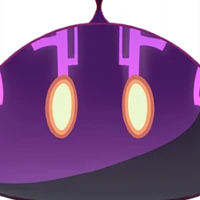

# Slimes

## Weakspot details

No weakspot.

## Energy drops

| HP Threshold | Type | Element |
| :--- | :--- | :--- |
| 66% HP | 1 particle |  Own element |
| 33% HP | 1 particle | Own element |
| Death | 1 orb | Own element |

## Resistance Table
All slimes are immune to their respective element.

| Damage Type | Resistance |
| :--- | :--- |
| Physical | 10% |
| Pyro | 10% |
| Dendro | 10% |
| Hydro | 10% |
| Electro | 10% |
| Anemo | 10% |
| Cryo | 10% |
| Geo | 10% |

## Stat Block

| Level | HP |
| :--- | :--- |
| 60 | 16763 |
| 65 | 19966 |
| 70 | 26104 |
| 75 | 29842 |
| 80 | 37131 |
| 85 | 40849 |
| 90 | 48708 |
| 95 | 55498 |
| 100 | 73530 |

## Large Slimes



## Anemo Slime

It is able to float in the air to a certain degree due to the power of Anemo.

## Weakspot Details

Anemo Slimes at any level will instantly die if they take any damage during their airborne attacks.

## Attacks

* If the player is in melee range, it will momentarily inflate to hit the target, dealing Anemo damage.
* If its' target is outside melee range, it will first wobble to indicate the start of its attack sequence, then jump into the air where it will inflate a second after reaching the max height of its jump. Shortly after it will start a barrage of Anemo projectiles at the players, one at a time, five projectiles in total. These projectiles deal Anemo damage and can interrupt player actions. If the slime takes any damage while in this state, it will deflate similar to poking a balloon, defeating it. It will also push the player away if too close, but not dealing any damage in the process.



## Cryo Slime

Competitors once spread malicious rumors that the Dawn Winery used Cryo Slimes to control the temperature of their wine cellar and preserve the quality of their alcohol.

## Attacks

* Cryo slimes have a cryo armor protecting them. While protected, it will either:
  * Attack the player with a ranged ice shard attack, launching 3 ice shards towards them at once, dealing Cryo damage.
  * Jump high into the air and falls on the player's position after a short delay, stomping on the landing zone.
After the shield is destroyed it will try to retreat, slowly hopping away, and use the ice mist attack against the player, dealing Cryo damage over time. After it creates the mist cloud, it will retreat into the middle of it, waiting for the armor to regenerate.
* The Cryo armor protecting the Cryo slime will take increased damage from blunt attacks.



## Dendro Slime

It has also taken on the weaknesses of the Dendro element, and will burn intensely the moment it meets a bright flame.

## Attacks  

* Similarly to the small Dendro Slime, the large variant will hide underground, but is much easier to spot than it's smaller variant due to the large flower on its' head. They will remain hidden until the player turns their back and walks away, in which case it'll follow up with a jump attack, or if they are either forcefully pulled out of the earth, or burnt with a pyro attack. The Dendro Slime will be ignited for large amounts of damage when entering contact with pyro aura, and will eventually have its' flower hat destroyed.  
After being forced outside the ground, it will attack in one of the following ways:  
* If the player is in melee range, it will use an AoE poison field around itself which will deal Dendro damage over time, but will not affect the player with Dendro (this is possibly a bug).
* If the player is outside melee range, it will use a ranged attack, shooting seeds at the player which will pop into lingering toxic clouds, dealing Dendro damage over time and inflicting the target with Dendro. If the inflicted target comes in contact with Pyro shortly after exposure, it will cause an explosion.
* It will periodically throw seeds which will grow into small Dendro slimes. These summoned slimes do not yield any drops and will disappear after the parent slime is killed. 3 slimes can be spawned with one such attack, but it is able to use it repeatedly for a total of 6 summoned Dendro slimes.



## Electro Slime

According to analyses, the jumping of Electro Slimes reflects the electric potential difference in the ground. In areas brimming over with Electro, their unusual movements can be observed and used to avoid danger.

## Mutant Electro Slime

Electro Slimes can undergo mutations to become bright yellow. Due to the abundant Electro within its form, it will deliver an electric shock to its surroundings from time to time, and it can even cause nearby Electro Slimes to release electric arcs. This arc lightning will not bounce between purple Electro Slimes, which shows that Electro Slimes have two different polarities. One wonders if some great new science could emerge from the study of such phenomena...

## Attacks
* Bump into the target, dealing electro damage.  
* Jump high into the air, then land at the player's location after a short delay, stomping on the landing spot.
* Creates a small field of electricity around the player.





## Geo Slime

Generally speaking, the crust of the earth is filled with Geo energy. Geo Slimes that are formed this way have a similarly "down-to-earth" sort of feeling.

## Attacks

* Geo slimes have a geo armor protecting them. While protected, it will either:

* Spew a rock at the player.
* Jump high into the air, then land at the player's location after a short delay, stomping on the landing spot.
* When their armor is destroyed, they will withdraw, and only attack by jumping into the air and stomping down on the target dealing normal damage. The armor will regenerate after some time.
* The Geo armor protecting the Geo slime will take increased damage from blunt attacks.



## Hydro Slime

Legend has it that some people would use Hydro Slimes as an emergency water source, packing them in preparation for travels through dry regions or deep domains. But due to the high concentration of Hydro within these slimes, direct ingestion is, in fact, harmful to the human body.

## Attacks

* Jump high into the air, then land at the player's location after a short delay, stomping on the landing spot.
* Throws a bubble in a high arc at the target, if hit by the bubble it will immobilize it. This attack can hit both the player or other mobs.



## Pyro Slime

Its intelligence is very basic, but its uses are just as broad — well, for hilichurls, that is.

## Attacks

Similarly to its' small version, it will only attack when ignited.  
While ignited it will attack in the following ways:  
* Attack by spewing three consecutive fireballs that have a parabolic trajectory to its' target.
* Jump high into the air, then land at the player's location after a short delay, stomping on the landing spot.
If it dies while affected by Pyro, a few seconds later, it will explode dealing AoE Pyro damage.  
If extinguished, it will retreat and re-ignite after some time.  


