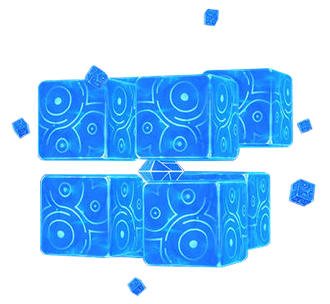

## Weakspot Details

None.

## Resistance Table

All Hypostasis are immune to their own element.
| Damage Type | Resistance |
| :--- | :--- |
| Physical | 0% |
| Pyro | 10% |
| Dendro | 10% |
| Hydro | 10% |
| Electro | 10% |
| Anemo | 10% |
| Cryo | 10% |
| Geo | 10% |

## Stat Block

| Level | HP |
| :--- | :--- |
| 60 | 58669 |
| 65 | 69880 |
| 70 | 91364 |
| 75 | 104446 |
| 80 | 129960 |
| 85 | 142971 |
| 90 | 170479 |
| 95 | 194242 |
| 100 | 257356 |

## Hypostases



## Anemo Hypostasis - Beth

Code name: Beth. A high-purity Anemo entity.Elemental hypostases are life forms which have completely abandoned their former appearance and biological structure, making them able to reach the highest level of elemental purity.Research into hypostases is mainly led by scholars of Sumeru Academia, but due to the level of danger that they pose, little of substance is known about hypostases beyond their scientific name and code name.

## Energy drops

| HP Threshold | Type | Element |
| :--- | :--- | :--- |
| 75% HP | 1 orb | anemo
| 50% HP | 1 orb | anemo
| 25% HP | 1 orb | anemo
| Death | 1 orb | anemo

## Attacks

* For most of the attacks below, the core will be exposed for a few seconds after the boss uses the attack. Use this opportunity to deal damage to the boss. Most of the attacks the Hypostasis does are Anemo.
* Flies into the air and turns into a giant crystalfly, then shoots 2 blasts at the player; the first blast is aimed towards the player's location, while the second is a follow-up that hits those struck by the first.
* Teleports to the center of the arena and spirals high into the air, forming a tornado beneath it. Over the next few seconds, forms 8 tornadoes around the arena, these tornados move randomly and don't target the player. 
  * The tornadoes will cause Elemental Absorption if they come into contact with Hydro, Pyro, Cryo, or Electro, and will leave behind an orb of their respective infusion in the air once the attack ends. If not infused with anything, they simply remain Anemo. Picking up these orbs grants 3 Energy particles of the respective element.
* Quickly flies next to the player and forms a ring of shell pieces that create a vacuum which pulls the player towards the core while dealing constant damage. After a short time, it will pull in the shell pieces and implode.
* Quickly flies next to the player and forms a large wall, which folds in a "clapping" motion very quickly, dealing damage in an area in front of the wall.
* Teleports next to the player and forms a spinning dome formation with its shell. It will then proceed to take 3 random orbs in the air, healing 5% of its health for each one and unleashes a large shockwave in the process. 
  * By default, this deals Anemo damage, but will deal Pyro, Hydro, Cryo, or Electro damage if it pulls in that orb.
* Moves to a location away from the player and sends pieces of its shell into the sky. Over the next few seconds, three total shell pieces will fall from the sky towards the player, these leave updrafts where they fall. 
  * The boss will not expose its core after this move, but its core will be exposed during the attack.
* Moves to a location away from the player and floats into the sky, forming a rhombus with its shell pieces. Then, it sucks shell pieces into its core to form and fire wind blasts that deal AoE damage, it fires a total of 3 blasts. Move around to dodge (can dodge without dashing).
 * When HP is low (approx. 5%), moves to the center of the arena and forms 4 large floating Anemo Orbs along with several updrafts. After some time , absorbs any Anemo Orbs that remain, healing a large portion of its HP for each orb absorbed. 
  * If an orb is absorbed by the player it will not respawn the next time the Hypostasis uses Second Wind, and if all orbs are absorbed by the player it will become unable to reuse this ability and unable to heal.
  * The boss can't be killed without resolving this attack first.



## Cryo Hypostasis - Daleth

Code name: Daleth. A high-purity Cryo entity.Research suggests that there are subtle differences between elemental hypostases and other elemental life forms in terms of their physical composition. Perhaps these differences can account for their high level of homeostasis and their almost mechanical movements.

## Energy drops

| HP Threshold | Type | Element |
| :--- | :--- | :--- |
| 75% HP | 1 orb | cryo
| 50% HP | 1 orb | cryo
| 25% HP | 1 orb | cryo
| Death | 1 orb | cryo

## Attacks

* For most of the attacks below, the core will be exposed for a few seconds after the boss uses the attack. Use this opportunity to deal damage to the boss.
* Creates a barrier of detonating icicles around itself while spawning icicles where the player is standing with a short delay.
* Quickly flies next to the player and forms a large wall, which folds in a "clapping" motion very quickly, dealing damage in an area in front of the wall.
* Transforms into a wheel that travels in a straight line towards the player that leaves a damaging Cryo trail behind it. This attack may turn up to three times in a row.
* Flies into the air and forms a rhombus with its' shell pieces before firing each of them at the player. 
  * The trajectory of these projectiles is curved.
  * The core is exposed during this attack.
* Forms a "skirt" of icicles which it shoots in three rings of increasing diameter. The last ring creates an area of Cryo that damages the player when stood on or jumped over. 
* When HP is low (approx. 5%), teleports to the center of the arena and forms a thick icy shield around the core. While maintaining this state, summons several Frostfruits around it while regenerating a percentage of HP every second. 
  * Homing Icicles will be fired periodically during this phase. 
  * Players are able to use Charged Attacks against the fallen Frostfruits to destroy the shield and expose the core.
  * The fallen Frostfruits will be placed at different distances depending on how far away the player is from the boss.
  * The boss can't be killed without resolving this attack first.



## Electro Hypostasis - Aleph

Code name: Aleph. A high-purity Electro entity.Elemental hypostases are the highest forms of elemental structures, usually formed either at a location bursting with elemental energy or at a clogged ley line.Elemental hypostases have developed various attacks based on their elemental attributes.

## Energy drops

| HP Threshold | Type | Element |
| :--- | :--- | :--- |
| 75% HP | 1 orb | electro
| 50% HP | 1 orb | electro
| 25% HP | 1 orb | electro
| Death | 1 orb | electro

## Attacks

* For most of the attacks below, the core will be exposed for a few seconds after the boss uses the attack. Use this opportunity to deal damage to the boss.
* Flies into the air and forms a rhombus with its shell pieces, firing two each for a total of four attacks.
  * The core will be exposed during this attack.
* Quickly flies next to the player and forms a large wall, which folds in a "clapping" motion very quickly, dealing damage in an area in front of the wall.
* Flies next to the player and turns into a giant fist, punching in the player's direction. Then, turns into giant scissors and deals damage in a "cutting" motion. Finally, turns into a giant hand and slaps the ground in front of it.
  * Sometimes only performs 1 or 2 of the attacks, but will always perform them in the given order.
* Turns into a giant drill and spins across the arena.
* Moves to the center of the arena and forms a spinning dome formation with its' shell while sending out many small waves of shell pieces.
* Sends shell pieces into the sky and rains them down in an octagon formation around the player, trapping them, before raining lightning in the cage. 
  * The cage can be broken by attacking the pillars with elemental damage.
  * The core will be exposed during this attack. 
  * This attack is usually performed only when the player takes too long to defeat the Electro Hypostasis.
* Forms a ring around its' core with its' shell pieces and fires lasers out in 4 directions. The ring will then rotate, the lasers moving with it. When the lasers turn off, the shell pieces quickly converge on the core.
  * The core will be exposed during this attack.
* When HP is low (approx. 5%), teleports to the center of the arena and forms 3 Electro Prisms, which can only be damaged by Elemental aura application. After 15 seconds, absorbs the Prisms and heals for 15%/35%/50% of its HP for 1/2/3 prisms absorbed. 
  * If a Prism is destroyed, it does not add to the healing and does not respawn next time the Electro Hypostasis uses this ability. 
  * When the player destroys all three Electro Prisms, the Electro Hypostasis dies immediately.
  * The boss can't be killed without resolving this attack first.




## Geo Hypostasis - Gimel

Code name: Gimel. A high-purity Geo entity.Elemental hypostases are ultra-compact structures with a high mass.Concentrated elemental energy forms a solid shell around the core of the hypostasis, leaving only the core reactive to elemental stimuli.

## Energy drops

| HP Threshold | Type | Element |
| :--- | :--- | :--- |
| 75% HP | 1 orb | geo
| 50% HP | 1 orb | geo
| 25% HP | 1 orb | geo
| Death | 1 orb | geo

## Attacks

* For most of the attacks below, the core will be exposed for a few seconds after the boss uses the attack. Use this opportunity to deal damage to the boss.
* Summons 4 pillars in a large triangle formation around the arena, it will sit on one at a time and teleport between them.
* Flies into the air and forms a rhombus with its' shell pieces before absorbing them all and using them to fire a continuous stream of stone pellets.
* Teleports next to the player and forms its' shell pieces into a giant hammer that it smashes into the ground, sending out a shockwave in front of it. 
  * This attack can only be used once all of the Hypostasis' pillars have been destroyed.
* Quickly flies next to the player and forms a large wall, which folds in a "clapping" motion very quickly, dealing damage in an area in front of the wall.
* Floats into the air and forms a sort of flat, plated formation out of shell pieces while channeling a Geo seal around the player. After a few seconds, it will break the seal and instantly summon a large, damaging pillar at the player's location.
* Floats into the air and briefly channels energy into the pillar it is floating on before emitting a single shockwave.
* Causes shell chunks and Geo pellets to continuously rain down in various small areas around the arena. This attack will only be used when the Hypostasis is on the ground, and only seems to work the first time it is used.
* Spirals into the air and channels energy into its pillar, causing all pillars to emit continuous shockwaves for the duration of the attack. 
  * This attack is deadly and deals a massive amount of damage. 
  * Attacking the concentrated Geo energy near the Hypostasis' pillar will create a Geo forcefield that blocks the shockwaves.
* When HP is low (approx. 5%), the Hypostasis teleports to the center of the arena and forms 3 pillars that channel Geo energy. After 15 seconds, the pillars are absorbed to heal 15%/35%/50% of its HP for 1/2/3 pillars absorbed. 
  * Destroying all pillars will immediately kill the Hypostasis. 
  * If a pillar is destroyed, it will not respawn the next time this ability is used. 
  * If if this move is completed, the Hypostasis will resummon 4 pillars in a triangle formation.
  * The boss can't be killed without resolving this attack first.




## Pyro Hypostasis - Ayin

Code Name: Ayin. A high-purity Pyro entity. Elemental hypostases have the ability to often enter a sort of "emergency restart" phase when they are about to be destroyed and can revive themselves in this way. Such rapid regeneration is not possessed even by most creatures for whom survival is the top priority.

## Energy drops

| HP Threshold | Type | Element |
| :--- | :--- | :--- |
| 75% HP | 1 orb | pyro
| 50% HP | 1 orb | pyro
| 25% HP | 1 orb | pyro
| Death | 1 orb | pyro

## Attacks

* For most of the attacks below, the core will be exposed for a few seconds after the boss uses the attack. Use this opportunity to deal damage to the boss.
* Has 2 states, ignited and extinguished.
  * Starts the battle ignited. While ignited, it will have a protective pyro armor, which is resistant to most elements but especially weak against hydro aura application.
  * In the ignited state, if its HP is less than 50%, it will regenerate 5% HP after every attack, including after reigniting.
While in Ignited State:
* Arranges itself as a molten boar that charges at the player before periodically surfacing above ground, then turns into a giant hand that leaps into the player's general location.
  * Sometimes it may do a follow-up attack, emerging at the player's general location and explodeing. The Hypostasis will disappear momentarily after exploding.
* Forms itself into a giant ball that curves at the player's location, leaving a damaging Pyro trail behind it.
* When near the player, it levitates high above ground, and plunges back down. This creates a Shockwave.
* Arranges itself into a Pyro Serpent that fires 3 damaging fireballs at the player's general location.
* Forms a giant ball that cracks open slowly. After some time, it causes a heavy explosion that does massive AoE Pyro DMG over the whole field.
While in Extinguished State:
* Flies into the air and forms a rhombus with its' shell pieces, firing them quickly from top to bottom.
  * The core will be exposed during this attack.
* Creates a barrier of sorts around itself, targeting random areas and sending a Pyro pillar at said locations, before recalling them, leaving a patch of fire in said area.
* Spins around while taking on the form of a rocket, deploying three Fire Seeds to reignite itself.
  * The amount of fuel regained is dependent on how many seeds were not extinguished, with a small amount restored if all seeds were extinguished.
  * The progress of refueling will be visible under the boss' health bar.
  * The Fire Seeds can be destroyed using elemental aura application.
* Like all other Hypostases, it has a Clap Move. Quickly flies next to the player and forms a large wall, which folds in a "clapping" motion very quickly, dealing damage in an area in front of the wall.




## Hydro Hypostasis - He

A high-level Hydro elemental life form codenamed "He".
Hypostases have strong rejection properties, and will mercilessly expel any that test them. The logic behind their behavior remains a mystery.

## Energy drops

| HP Threshold | Type | Element |
| :--- | :--- | :--- |
| 66% HP | 1 orb | hydro  
| 33% HP | 1 orb | hydro
| Death | 1 particle | hydro

## Attacks

* Draws in water and then jiggles around in a bubble before exploding into two smaller bubbles towards different directions which transform into slime-like 'Water Droplets. 
  * The darker blue droplet will head towards the player and explode, while the lighter blue droplet will send healing dots towards the boss. 
  * If there is one droplet but not the other, it will only summon the other droplet.
  * The Water Droplets can be destroyed using elemental aura application or dealing enough damage to them.
* Transforms into a twisting serpentine form that spirals around vertically before diving into the ground.
  * This attack causes bubbles to rise from the ground all around for a while after.
* Dives into the ground before turning into a pod of Dolphins, which leap towards the player in a curved trajectory.
* Transforms into a twister while summoning circles of deadly rain from the sky.
* Dives into the ground to re-emerge in the middle of the arena.
* Dives into the ground before transforming into a single large cube while calling rolling waves from the edges of the arena to roll in towards it, before causing a large splash at the end.
* Creates a summoning circle and spins a ring of water around before covering itself in a bubble and then going vulnerable in the circle. 
  * While in this state it will cause dolphins to emerge from the ground all around.
* Transforms into a ray and slaps the ground releasing bursts of water in a line ahead.
* When HP is low (approx. 5%), dives into the ground to warp to the center of the arena and summon three large 'Water Droplets' which will slowly head towards the boss. If the droplets are not defeated in time, they will touch the boss and heal it. 
  * Droplets that are defeated will not reappear the next time the boss uses this ability.
  * The boss can't be killed without resolving this attack first.



