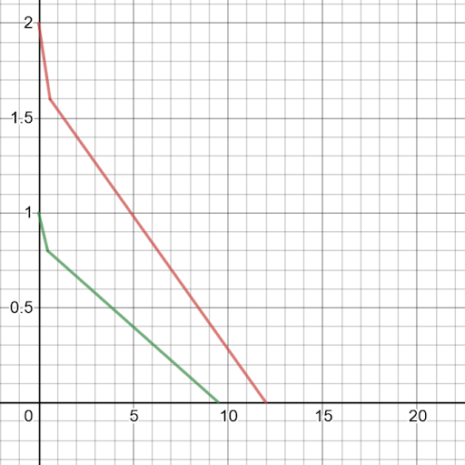
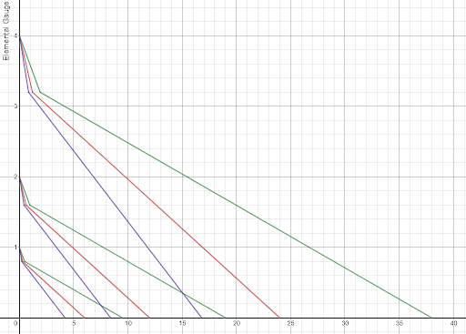

# Elemental Gauge Theory

## Disclaimer

To our knowledge, the framework of Elemental Gauge Theory can be applied to explain any elemental-related concept in Genshin. Extensive testing has been done and is viewable in the Evidence Vault under Gauge Unit Theory - Testing and Evidence.


There is a [Definitions](https://library.keqingmains.com/mechanics/combat/elemental-reactions/elemental-gauge-theory#definitions) section at the bottom if any of the terms used are unfamiliar.


## General Overview

When an elemental source is used to apply an **aura**, it applies a number of elemental units onto the enemy. The [Gauge Unit Database](https://docs.google.com/spreadsheets/d/1uiJje5yqv7v2UKrWoBAgBMrHrrNemtkooo8JqAGJpP8/edit?usp=sharing) should be referenced to see how many U each source applies. Below is a table that showcases the details of each gauge found in the game so far:

| Gauge | Post Tax | Decay Rate | Duration |
| :--- | :--- | :--- | :--- |
| 1U | 0.8U | 1U/9.5s | 9.5s |
| 2U | 1.6U | 1U/6.0s | 12s |
| 4U | 3.2U | 1U/4.25s | 17s |

Why is 2U = 12s, but 1U isn’t 6s? This is because a 2U aura has a **higher decay rate** than a 1U aura. Larger U means a bigger elemental gauge, at the cost of an increased rate of decay.

## Notation

Units \(U\) are reported as the type of aura they apply, but elemental applications have to account for decay rate and reactions so the notation for Elemental Gauge Theory should be appended. 

When extending auras with stronger attacks with higher U or consuming auras via elemental reactions, **the resulting auras are not simply an addition of the unit U**. Therefore, Gauge Units \(GU\) and the decay rate have to be separated from each other to make good general use of the theory.

Gauge Units are used to calculate the remaining aura on for elemental reactions. The decay rate of the remaining aura will be the first applied aura and should be written as stated below.

The decay notation number indicates the original system of elemental units that are applied \(1U, 2U, or 4U\), while the new notation \(A, B, or C\) notes the decay rate of the aura. 

| Original Notation | Reaction Notation | Decay Notation | Decay Rate Conversion |
| :--- | :--- | :--- | :--- |
| 1U | 1GU | 1A | 9.5s per A |
| 2U | 2GU | 2B | 6.0s per B |
| 4U | 4GU | 4C | 4.25s per C |

**Example of New Notation:**

> Kaeya’s E applies 2GU Cryo aura and is triggered by Fischl’s charged shot, applying 1GU Electro. Superconduct occurs, 1GU cryo aura remains, but the decay rate is still 1B\(6.0s per B\).

## Decay Rate

Decay rate is determined by the **first aura** applied. This decay rate is always in effect, until the aura is fully consumed/decayed. Additional applications of the aura element will apply their own respective gauges, but follow the decay rate of the original aura.

Meaning, a 2B or 4C gauge can be decaying at the rate of a 1A gauge. To do this, apply a 1A gauge, then apply a 2B or 4C gauge of the same element to get 2A or 4A gauges.

> Fischl's Charged Shot to applies 1A Electro, the use of Beidou's Q will add 4C Electro to the gauge, resulting in a 4A Electro aura persisting for 38 seconds from the time of Beidou Q.

* **Y-axis** = amount of elemental gauge
* **X-axis** = duration in seconds
* **Purple** = 4C decay rate
* **Red** = 2B decay rate
* **Green** = 1A decay rate

## Overload, Superconduct, and Freeze

When an elemental trigger is applied, it subtracts the corresponding number of elemental units from the enemy’s existing gauge.

> Kaeya’s E applies 2GU Cryo aura and is triggered by Fischl’s charged shot, applying 1GU Electro. Superconduct occurs, 1GU Cryo aura remains, but the decay rate is still 1B\(6.0s per B\).

If the Trigger Gauge is greater than the Aura Gauge, a reaction will still occur and the aura will be fully consumed and no element will be left behind because **gauges cannot go below zero**.

> Fischl’s charged shot applies 1GU Electro aura and is triggered by Kaeya’s E, applying 2GU Cryo. Superconduct occurs, and no aura is left behind as triggers can only remove units, they can’t add aura/gauge.

## Melt and Vaporize

### Reaction Basics

* Melt and Vaporize have weak and strong elements
* Using a weak element as the trigger results in a 1.5x dmg multiplier

  > Cryo triggering Melt and Pyro triggering Vaporize

* Using a strong element as the trigger results in a 2.0x dmg multiplier

  > Pyro triggering Melt and Hydro triggering Vaporize

### **Unit Modifiers to Gauge Consumption**

Weak amping elemental triggers have a 0.625x modifier**.**

| Elemental Gauge of Source | After Unit Modifier |
| :--- | :--- |
| 1GU | 0.625GU |
| 2GU | 1.25GU |

> An enemy affected by Amber’s Charged Shot has 2GU Pyro. Using Kaeya’s E \(2GU Cryo\) only removes 1GU of Pyro because weak melt occurs when the trigger is Cryo.

Strong amping elemental triggers have a 2.5x modifier

| Elemental Gauge of Source | After Unit Modifier |
| :--- | :--- |
| 1GU | 2.5GU |
| 2GU | 5GU |

> An enemy affected by Kaeya’s E has 2GU Cryo. Using Diluc’s E \(1GU\) removes 2.5GU worth of Cyro aura because strong melt occurs when the trigger is Pyro. This leaves us with 0GU Cryo as gauges cannot go below zero.

## Crystallize and Swirl

Geo and Anemo can only be used as the trigger for crystallize and swirl reactions respectively. All Geo/Anemo triggers have a 0.5x unit modifier.

> Using a 1GU Geo trigger on a 1GU Electro aura will result in Crystallize, and only subtract 0.5GU.

## Electro-Charged

Currently, how electro-charged fits into the Elemental Gauge Theory is still up in the air. This is because electro-charged \(EC\) is unique to all previously covered reactions. The current theory is that in EC, both Hydro and Electro simultaneously function and coexist as both the aura and trigger.

EC is triggered when an enemy with a Hydro or Electro aura has the other aura applied to it. EC will tick once per second so long as enough electro and hydro gauge remain, except in the following case:

> When either the Electro or Hydro gauge completely decays, the next EC tick will prematurely occur at the moment at which the gauge completely decayed. However, if one of the gauges empties within 0.5s of the last EC tick, there will not be another tick of EC.

Each tick of EC consumes 0.5GU from both gauges. Once a gauge is empty, the element will disappear from the enemy’s status, but the other remaining gauge will remain available to further reactions.

## Definitions

**Aura =** If a targetable entity is currently not affected by any element, the next elemental source will apply an aura.

**Aura Tax** = A reduction of an Aura’s gauge shortly after it’s applied. As of now, there is no explanation as to why it occurs, but it is still important to keep in mind.

**Elemental Decay** = An aura will persist a certain duration depending on the type of elemental source. Think of the duration as a gauge that can decay or be reduced in 2 ways:

* Via time \(A, B, C\)
  * The gauge will decay over time. Each letter represents a different decay rate, which can be referenced in [Notation](https://library.keqingmains.com/mechanics/combat/elemental-reactions/elemental-gauge-theory#notation). Once the gauge empties, the elemental aura disappears.
* Via reactions \(GU\)
  * When you apply an elemental trigger to an existing elemental aura, a certain amount of the gauge is consumed. If an amount remains, then the aura will persist after the reaction. If the gauge is fully consumed, the aura disappears.

**Elemental Gauge / Gauge Units \(GU\)** = The strength of an elemental source, which dictates how much of the aura is consumed when a reaction occurs.

See [Gauge Unit Database](https://docs.google.com/spreadsheets/d/1uiJje5yqv7v2UKrWoBAgBMrHrrNemtkooo8JqAGJpP8/edit?usp=sharing) to see each source’s U value

**Elemental Source** = An element-imbued attack or skill that will apply an element on the enemy. All elemental sources should have the decay and GU appended.

**Internal Cooldown \(ICD\)** = A hidden timer which occurs when an **elemental source** applies an **aura** or **trigger** to an enemy.

* During this ICD, repeated use of that specific elemental source **WILL** do elemental damage, but **WILL NOT** apply an aura/trigger 

**Trigger** = If a targetable entity has an **existing aura**, the next elemental **source** will act as a **trigger** for a reaction.

**Unit Modifier** = A modifier that applies to the **triggers** of: Melt, Vaporize, Crystallize, and Swirl.

* This modifier can increase or decrease how much of the aura is consumed in said reactions.

## **External Links**

* [Genshin Impact Fandom](https://genshin-impact.fandom.com/wiki/Elemental_Reactions#:~:text=Transformative%20Reactions%20include%20Overloaded%2C%20Shattered,Elemental%20Mastery%20of%20the%20character)

**Tags:** [Elemental Reactions](./)

**Evidence Vault:**



