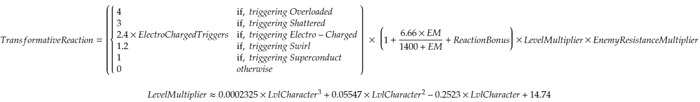

# Transformative Reactions

Transformative reactions scale based off of Elemental Mastery and character level, preventing them from scaling very well.

## **Overload**

Overload is an elemental reaction triggered by applying Pyro on a target already afflicted by an Electro aura or vice versa. Overload will cause an explosion of Pyro damage to occur that will destroy Geo shields quickly. Triggering Overload in an AoE will only cause one instance of Overload damage.

* You can trigger Overload on electrocuted bodies of water.

## **Superconduct**

Superconduct is an elemental reaction triggered by applying Electro on a target already afflicted by a Cryo aura or vice versa. Superconduct will reduce the physical damage resistance by 40% by 12 seconds. Triggering Superconduct in an AoE will only cause one instance of Superconduct damage.

## Electro-Charged

Electro-Charged is a special Transformative reaction that breaks the normal rule of “1 elemental aura on an enemy at a time." When an enemy is Electro-Charged, both the Hydro and Electro aura lie underneath the Electro-Charged status. It follows that when applying a third element, like Pyro, you can trigger both Vaporize and Overload in the same damage instance. Since Electro-Charged hides the underlying Hydro and Electro auras, it continues to tick every second until there are 0.5s worth of Electro and Hydro aura remaining. For a more detailed description of Electro-Charged, refer to the [Evidence Vault.](https://library.keqingmains.com/evidence/mechanics/combat/elemental-reactions/transformative-reactions#electrocharged)

Electro-Charged can be extended by hitlag, probably by extending the aura duration.

Electro-Charged can also spread to adjacent targets if they have a Hydro aura, however, the chain lightning applies the Electro-Charged damage without applying an elemental aura.

## Shatter

Heavy attacks \(such as Claymores, Geo, Klee's bombs, etc\) will apply Shatter on Frozen targets before any Elemental damage is dealt, preventing you from Melting or Vaporizing. Attacks that apply Shatter have different GU values, refer to the [Evidence Vault](https://library.keqingmains.com/evidence/mechanics/combat/elemental-reactions/transformative-reactions#various-gu-values-of-shatter-based-on-different-types-of-attacks) for extended reading on Shatter GU by Bobrokrot.

## Frozen

Frozen is an elemental reaction triggered by applying Cryo on a target already afflicted by a Hydro aura or vice versa. If the Frozen aura expires or is Shattered, any underlying Hydro or Cryo aura will persist, note that the Cryo or Hydro application to trigger Frozen will consume the appropriate amount of aura. 

Additionally, one reaction occurs at a time, if you apply Pyro to a Freeze aura that has an underlying Hydro aura, only the Melt occurs. If the underlying aura is Cryo, Cryo can Melt, so the Melt will reduce both the Freeze and the original Cryo aura. Some reactions effect both, others only effect one.

| Reaction | Freeze Aura | Underlying Cryo | Underlying Hydro |
| :--- | :---: | :---: | :---: |
| Melt |  ✔️ | ✔️ | ❌ |
| Superconduct |  ✔️ | ✔️ | ❌ |
| Shatter |  ✔️ | ❌ | ❌ |
| Swirl |  ✔️ | ✔️ | ✔️ |
| Crystallize | Shatter | ✔️ | ✔️ |

The duration of Freeze is dependent on the lowest gauge element when it is triggered, regardless of their order. It scales non-linearly with the aura strength of Hydro and Cryo.

‌

The behavior of Freeze curves to give diminishing returns at higher GU values. This curve predicts a duration of about 5.7s for 2U.

## Evidence Vault:



